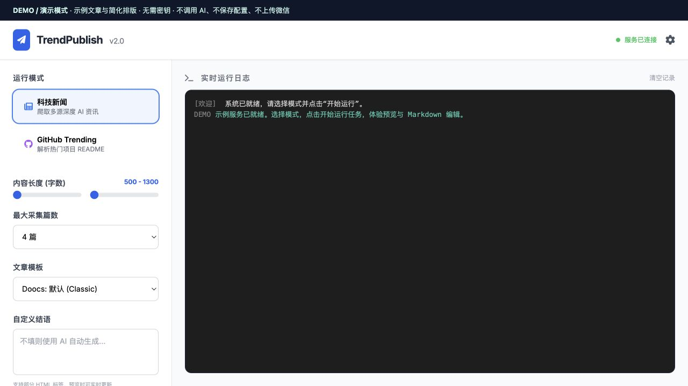

<p align="center"><strong>English</strong> | <a href="README.zh-CN.md">简体中文</a></p>

<div align="center">


# AITrendPublisher

**Turn AI news and GitHub discoveries into articles you can edit and send to WeChat.**

Deno · TypeScript · Markdown · WeChat Official Accounts

[Documentation / 文档导航](docs/README.md) · [Try the demo](#try-it-before-configuring-anything) · [Setup guide](docs/GETTING_STARTED.md) · [Architecture](docs/ARCHITECTURE.md)

</div>

You find an interesting project. Then come the tabs, notes, translation, formatting, image handling, and copying into WeChat. **AITrendPublisher brings those steps into one local publishing workbench.** Choose a source, prepare an article, refine the Markdown, and review its layout before creating a WeChat draft.

The application calls itself **TrendPublish** in the interface. `AITrendPublisher` is the repository name; `WX_Publisher` is an older local folder name for the same codebase.

> **What “publish” means:** the implemented WeChat publisher creates a **draft**. Review and send the article from the WeChat Official Account backend. This project does not automatically broadcast it to subscribers.

## Who is it for?

For editors, developers, and newsletter writers who want to turn technology sources into an article they can review. **WeChat Official Accounts** are publishing accounts inside WeChat; the current delivery adapter sends an article to their draft box. You can explore the demo without a WeChat account, but a real publishing run currently requires one.

**Language support:** these project guides are available in English and Simplified Chinese. The application interface and demo article are currently in Chinese, and the existing writing prompts primarily target Chinese articles. English documentation does not imply an English UI or automatic support for every output language. The [English UI label guide](docs/DEMO.md#find-your-way-around-the-chinese-interface) helps you follow the screenshots and controls.

## See the workflow


### 1. Choose what to cover

Switch between technology news and GitHub Trending. Set the article count and writing length for news, then follow progress in the live log panel. GitHub mode focuses on one project in the current UI.



### 2. Read it as an article

Preview the assembled article, try a template, and check its structure before uploading. The demo supplies a clearly labeled sample so you can explore immediately.


### 3. Make it sound like you

Open **再改改 (Edit / refine)** to edit the full Markdown beside its preview. The live application also offers model-assisted rewriting; the demo supports manual editing and blocks AI calls.


*Screenshots show the actual control panel with a fixture backend. Sample text is hand-authored, and demo HTML uses a simplified renderer. These are not evidence of a live scrape, model response, or successful WeChat upload.*

## Try it before configuring anything

Install [Deno 2](https://docs.deno.com/runtime/getting_started/installation/), then clone the public repository and start the demo:

```bash
git clone https://github.com/Jack-Li-Npu/AITrendPublisher.git
cd AITrendPublisher
deno task --config demo.json demo
```

Open **http://127.0.0.1:8001**. Choose a mode → **开始运行任务 (Run task)** → **再改改 (Edit / refine)** → edit Markdown → **保存修改 (Save changes)**.

- No `.env`, API keys, database, or backend dependency installation needed.
- Demo changes live in memory and disappear when the demo server stops.
- Configuration saving, AI rewriting, and WeChat uploading return explicit demo-only messages.
- The existing UI loads styles, icons, and Mermaid from public CDNs, so browser internet access is still needed.

[Follow the demo walkthrough →](docs/DEMO.md)

## Run with your own sources and models

```bash
git clone https://github.com/Jack-Li-Npu/AITrendPublisher.git
cd AITrendPublisher
cp .env.example .env
deno install --allow-scripts
# Fill in your provider credentials and WeChat configuration in .env.
deno task start
```

If you already cloned the repository for the demo, continue in that directory and skip the clone commands. Windows: use `Copy-Item .env.example .env` in PowerShell. The repository also includes `setup.ps1`, `setup.bat`, `setup.sh`, `start.bat`, and `start.sh`.

The live panel opens at **http://127.0.0.1:8000**. Start with the demo if you only want to understand the project. A real run needs model credentials and currently checks WeChat credentials/IP access even when `previewOnly` is set. Technology news additionally uses Firecrawl; cover generation requires its own provider configuration.

**First-run defaults:** the live server binds to loopback, the database is optional, and scheduled jobs are off unless `ENABLE_CRON=true`. Existing installations that need the daily schedule must explicitly opt in.

[Provider settings, prerequisites, troubleshooting, and scheduling →](docs/GETTING_STARTED.md)

## What is implemented?

| Capability | Current behavior |
| --- | --- |
| Technology news | Multiple configured sources, fetched through Firecrawl; visible in the UI |
| GitHub Trending | Trending discovery and README retrieval; visible in the UI; some processing uses README content directly |
| AI news website | Direct news-site scraper; backend mode `AI_NEWS_SITE` |
| Single URL / topic search | Backend branches `SINGLE_URL` / `TOPIC_SEARCH`; their UI controls are currently commented out |
| Article preparation | Mode-dependent translation, summaries, titles, introductions, and image handling |
| Model adapters | DeepSeek, Gemini, OpenAI-compatible providers, Qwen, Claude, and Xunfei adapters exist; availability depends on configured endpoints/models |
| Editing and layout | Full Markdown editing, live preview, model-assisted refinement, and Doocs-derived rendering |
| Delivery | Image upload and WeChat draft creation; final sending happens in WeChat |
| Storage | Local article/source files and registries; optional MySQL + Drizzle/vector support |
| Scheduling | Opt-in daily workflow at 03:00 Asia/Shanghai; scheduled runs can create drafts without the UI review step |

## How it is built

This is a **single-process Deno application with a plain HTML/JavaScript frontend**. There is no React or Next.js build step. The page talks to a Deno HTTP server using JSON-RPC and receives logs through Server-Sent Events.

```text
public/index.html               Control panel, Markdown editor, preview
        │ JSON-RPC + SSE
src/server.ts                   HTTP routes and log stream
        │
src/controllers/                UI actions, workflow trigger, cron
        │
src/services/weixin-article.workflow.ts
        ├── modules/scrapers/   News, GitHub, Firecrawl
        ├── providers/llm/      Model adapters
        ├── modules/render/    Markdown → article HTML
        └── modules/publishers/ WeChat images + drafts
```

[Read the architecture map and “where do I change X?” guide →](docs/ARCHITECTURE.md)

## Project status

This is a local publishing tool under development. The demo has automated checks for editing, HTML escaping, blocked external actions, and file exposure. The main application still has pre-existing TypeScript errors; see [verification notes](docs/VERIFICATION.md). Live provider calls and WeChat draft creation need a configured account and were not exercised for these screenshots.

The preview is held in memory, source sites can change, and the application is intended for one trusted local operator. Keep the live panel on loopback; its configuration API handles credentials. Generated content and `.env` are excluded from new commits.

## License and acknowledgments

[MIT](LICENSE). The article renderer includes code derived from [Doocs MD](https://github.com/doocs/md), alongside the open-source dependencies listed in [deno.json](deno.json).
