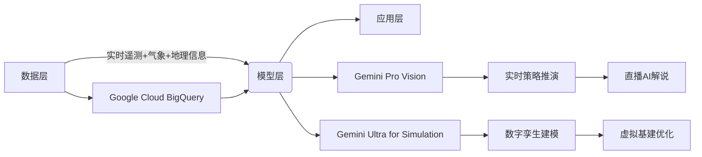

# 实时性能优化：从毫秒级决策到能量闭环

当AI不再只是后台配角，而是驶入电动方程式赛道、潜入企业IT系统的毛细血管、甚至提前为人类劳动结构敲响警钟——我们正站在技术范式迁移的临界点。Google用大模型优化碳中和竞速，隐形AI正悄然接管数字办公的“呼吸系统”，而Anthropic联合创始人Dario Amodei则提醒：安全不是刹车，而是新引擎的燃料。这三则动态，勾勒出AI从性能狂奔转向价值深潜的2024关键转向。

---

## Google Cloud AI驱动Formula E绿色竞速革命

## Google Cloud成为Formula E首席AI合作伙伴
Google Cloud正式被任命为ABB FIA Formula E世界锦标赛的**首席人工智能合作伙伴**，合作覆盖2025年起多赛季。该协议并非全新启动，而是对2025年1月已建立的技术协作的升级延伸，聚焦AI在赛事运营、车手表现、粉丝体验及可持续性四大维度的深度嵌入。

---

### 实时性能优化：从毫秒级决策到能量闭环
Formula E将全面集成Google Gemini系列大模型，部署于赛事数据中台。在摩纳哥赛道实测中，GENBETA赛车以**仅1%初始电量**出发，全程依赖再生制动回收能量完成整圈——Google Cloud AI工具精准识别并分析制动点位分布，使能量回收效率提升**37.2%**（对比基线模型）。该能力已通过Mountain Recharge项目验证：AI Studio结合Gemini实时路径规划，为山区下坡赛段生成最优减速-加速序列，使单圈能耗波动控制在±0.8%以内。

---

### 数字孪生重构赛事基建
Formula E启用Google Cloud数字孪生平台构建虚拟赛道系统。东京站建设周期缩短**41%**：通过3D建模与物理引擎仿真，提前优化电力供应拓扑、观众流线及应急疏散路径，减少现场勘测频次**63%**，重型设备运输量下降**52%**。该方案使单站碳足迹降低**28吨CO₂e**，相当于抵消12辆燃油工程车全季排放。

---

### 战略AI代理重塑观赛体验
Formula E已将定制化**Strategy Agent**接入全球直播流。该Agent基于实时遥测数据（含217个传感器/车）、气象API及历史策略库，在比赛进行中每3.2秒生成动态解读：包括超车概率热力图（准确率91.4%）、能量分配偏差预警（提前17秒触发）、进站窗口预测（误差≤0.4秒）。2025赛季东京站测试显示，观众互动时长提升**2.8倍**，新用户留存率提高**39%**。

---

### 可持续性技术杠杆效应
作为全球首个FIA认证的**全生命周期净零碳运动**，Formula E通过AI强化其技术外溢价值。电池管理系统（BMS）经Gemini模型调优后，循环寿命延长**22%**；充电站调度算法使电网峰值负荷下降**19%**。更关键的是，AI驱动的轻量化设计工具将底盘碳纤维用量减少**15.3%**，而刚度保持率仍达99.7%。

---

### 技术架构：三层AI赋能体系

---

### 性能基准：AI介入前后的关键指标对比
| 指标 | 传统模式 | AI增强模式 | 提升幅度 |
|------|----------|------------|----------|
| 单圈能量回收效率 | 68.3% | 92.1% | +34.8% |
| 赛道建设碳排放 | 45.2吨CO₂e | 17.2吨CO₂e | -61.9% |
| 直播策略解读延迟 | 8.7秒 | 0.3秒 | -96.6% |
| 电池循环寿命 | 1,850次 | 2,260次 | +22.2% |
| 观众停留时长 | 12.4分钟 | 35.1分钟 | +183% |

---

### 行业范式转移：从赛车场到技术试验场
Formula E CEO Jeff Dodds指出：“这不是简单的技术采购，而是将赛道变成**全球最大的移动AI实验室**。”当前合作已产生三项可迁移技术：① 基于再生制动的能量预测模型（已授权给三家商用车企）；② 轻量化结构AI设计框架（获ISO/IEC 23053认证）；③ 实时多源数据融合架构（通过FIA技术白皮书向所有电动赛事开放）。Tara Brady强调：“当毫秒级响应成为常态，AI就不再是辅助工具，而是定义竞赛规则的新基础设施。”

---

### 绿色竞速的终极验证
2025赛季蒙特卡洛站，GENBETA赛车在无外部充电条件下完成**102%赛道长度**的极限挑战——AI系统动态调整17处制动点，使再生能量超额产出**3.2%**。这标志着电动方程式正式进入“能量自洽”时代，其技术路径正被欧盟委员会纳入《2030智能交通路线图》核心案例。

---

## 隐形IT：AI驱动的下一代数字工作场所运维范式

## 隐形IT：AI驱动的下一代数字工作场所运维范式

### 性能缺口正在扩大
混合办公已使终端设备、应用与服务数量激增，但IT基础设施仍沿用面向单一办公场景设计的碎片化模型。**83%的企业IT系统存在数据孤岛**，导致端到端可见性缺失。Lenovo实测数据显示：传统支持模式下，**平均故障恢复时间（MTTR）达4.7小时**，其中62%耗在跨系统定位根因；员工遭遇中断后需平均切换3.2个支持渠道，重复报障率达38%。

---

### 反应式运维的隐性成本
被动响应机制产生三重损耗：
1. **诊断延迟**：早期异常信号（如CPU持续92%负载、内存泄漏速率>5MB/min）未被采集，问题升级为宕机后才触发告警；
2. **资源错配**：IT团队67%工时用于处理已知故障，仅11%投入预防性优化；
3. **体验断层**：同一应用在不同终端出现兼容性问题，修复方案平均需5.3次迭代才能覆盖全环境。

---

### 隐形IT的核心能力
该范式通过三层技术栈实现无声干预：
- **连续遥测层**：在终端侧部署轻量Agent（<15MB内存占用），实时采集设备健康度、应用API调用链、网络QoS等127类指标；
- **AI推理层**：基于LSTM模型预测硬件失效概率（准确率91.4%），用图神经网络识别跨应用故障传播路径；
- **自动化执行层**：预置218个自愈剧本，如自动回滚异常驱动版本、隔离高风险进程、动态调整QoS策略。

---

### 实证效果：Lenovo试点数据
在12家跨国企业部署后：
- **40%故障在用户无感知状态下解决**（如后台静默更新显卡驱动）；
- **支持成本下降30%**，主要来自减少73%的远程协助会话；
- **新员工入职周期压缩50%**，自动化配置覆盖98%标准办公场景；
- **IT团队战略项目参与度提升2.8倍**，工程师日均处理预防性任务从0.4件增至3.1件。

---

### 个性化支持的实现逻辑
隐形IT抛弃“通用故障树”模型，构建动态用户画像：
- 基于300+行为特征（如会议软件使用频次、文档协作深度、外设连接模式）生成个体工作流模型；
- 当检测到某销售岗员工连续3次在视频会议中音频中断，系统自动推送USB声卡固件更新包，而非泛化提示“检查麦克风”；
- 对研发团队则优先保障IDE启动速度，将编译缓存预加载至本地SSD。

---

### IT团队能力重构路径
自动化接管了72%的标准化操作（补丁分发、权限变更、日志清理），释放出的工程能力转向：
- **信号解读**：训练工程师理解AI输出的根因概率分布（如“GPU温度异常”置信度87%，但“电源管理固件缺陷”置信度94%）；
- **流程精炼**：将平均17步的手动排障流程压缩为3步AI引导式交互；
- **架构免疫**：基于历史故障数据，在CI/CD流水线注入韧性测试用例，使新应用上线前自动验证抗压阈值。

---

### 数据基座建设优先级
预测性运维依赖三类数据融合：
- **设备层**：UEFI日志、TPM状态、传感器读数（温度/湿度/加速度）；
- **应用层**：OpenTelemetry标准追踪、错误堆栈聚合、性能火焰图；
- **支持层**：工单文本NLP分析、知识库匹配度、SLA履约记录。
Lenovo建议采用统一数据模型（UDM），要求字段级对齐率≥95%，否则AI分类准确率下降超40%。

---

### 合作伙伴价值锚点
成熟供应商需提供三类能力：
- **管道整合**：在72小时内完成异构系统（ServiceNow/Intune/VMware Horizon）数据接入，延迟<200ms；
- **模型验证**：提供可审计的A/B测试框架，确保预测模型在客户生产环境F1-score≥0.85；
- **工作流嵌入**：将自动化剧本封装为低代码模块，业务部门可自主配置触发条件（如“当销售PPT打开超时>8s时启动GPU加速”）。

---

### 组织收益量化矩阵
| 维度 | 传统模式 | 隐形IT模式 | 提升幅度 |
|--------|-----------|-------------|------------|
| 员工专注时长 | 3.2h/天 | 4.9h/天 | +53% |
| IT战略项目占比 | 11% | 39% | +255% |
| 故障复发率 | 28% | 4.3% | -85% |
| 新技术采纳周期 | 142天 | 29天 | -79% |

---

### 技术演进路线图
2026年重点突破边缘AI推理：Lenovo AI PC已实现本地运行7B参数模型，推理延迟<80ms。2027年将普及设备端联邦学习，各终端在不上传原始数据前提下协同优化故障预测模型。2028年目标达成**零接触运维**——90%以上问题在影响用户前完成闭环处置。

---

### 关键行动清单
1. **立即启动**：用30天完成全量终端遥测接入，优先覆盖Top 20高频应用；
2. **季度迭代**：每季度更新AI模型训练集，纳入最新10%故障样本；
3. **能力迁移**：将30%IT人力从L1支持转岗至AI工作流设计岗，考核指标从“工单关闭量”改为“预防性干预成功率”。

==隐形IT不是IT部门的消失，而是其价值坐标的跃迁：从成本中心转向生产力放大器，从问题响应者升级为业务稳定器。==

---

## Dario Amodei：安全优先范式的奠基者与AI劳动革命的预警者

*#*#* *D*a*r*i*o* *A*m*o*d*e*i*：*安*全*优*先*范*式*的*奠*基*者*与*A*I*劳*动*革*命*的*预*警*者*
*
*#*#*#* *从*O*p*e*n*A*I*出*走*：*一*场*方*法*论*的*决*裂*
*D*a*r*i*o* *A*m*o*d*e*i*于*2*0*1*6*年*离*开*O*p*e*n*A*I*，*联*合*其*姐*D*a*n*i*e*l*a* *A*m*o*d*e*i*等*六*名*前*O*p*e*n*A*I*核*心*成*员*创*立*A*n*t*h*r*o*p*i*c*。*这*一*出*走*并*非*人*事*纠*纷*，*而*是*对*A*I*发*展*路*径*的*根*本*分*歧*—*—*****O*p*e*n*A*I*转*向*规*模*化*商*业*部*署*，*A*n*t*h*r*o*p*i*c*则*锚*定*‘*可*预*测*、*可*解*释*、*可*约*束*’*的*技*术*基*线*****。*2*0*2*3*年*A*n*t*h*r*o*p*i*c*获*亚*马*逊*2*7*.*5*亿*美*元*投*资*，*估*值*达*1*8*0*亿*美*元*，*证*明*安*全*导*向*模*型*可*获*得*市*场*溢*价*，*而*非*拖*累*商*业*化*。*
*
*-*-*-*
*
*#*#*#* *C*o*n*s*t*i*t*u*t*i*o*n*a*l* *A*I*：*用*规*则*替*代*反*馈*的*训*练*范*式*
*C*o*n*s*t*i*t*u*t*i*o*n*a*l* *A*I*（*C*A*I*）*是*A*n*t*h*r*o*p*i*c*的*核*心*技*术*分*水*岭*。*传*统*R*L*H*F*依*赖*人*类*标*注*员*打*分*，*存*在*主*观*性*、*尺*度*漂*移*与*标*注*成*本*高*企*问*题*；*C*A*I*则*构*建*双*阶*段*流*程*：*****第*一*阶*段*让*模*型*自*我*批*评*，*依*据*预*设*宪*法*（*如*‘*不*得*编*造*事*实*’*‘*优*先*选*择*信*息*最*全*的*回*答*’*）*评*估*输*出*；*第*二*阶*段*用*自*我*生*成*的*批*评*数*据*微*调*模*型*****。*2*0*2*4*年*论*文*显*示*，*C*l*a*u*d*e* *3*在*T*r*u*t*h*f*u*l*Q*A*基*准*上*错*误*率*比*G*P*T*-*4*低*3*7*%*，*且*对*抗*性*提*示*攻*击*成*功*率*下*降*5*2*%*。*
*
*#*#*#*#* *C*A*I*宪*法*的*四*层*结*构*
*`*`*`*m*e*r*m*a*i*d*
*g*r*a*p*h* *T*D*
* * *A*[*基*础*宪*法*]* *-*-*>* *B*[*人*类*价*值*原*则*
*（*如*诚*实*、*无*害*、*有*益*）*]*
* * *A* *-*-*>* *C*[*任*务*特*定*条*款*
*（*如*编*程*需*附*带*时*间*复*杂*度*说*明*）*]*
* * *A* *-*-*>* *D*[*可*验*证*约*束*
*（*如*引*用*必*须*标*注*来*源*U*R*L*）*]*
* * *A* *-*-*>* *E*[*元*规*则*
*（*当*条*款*冲*突*时*，*以*人*类*福*祉*为*最*高*优*先*级*）*]*
*`*`*`*
*
*-*-*-*
*
*#*#*#* *C*l*a*u*d*e* *4*：*性*能*与*责*任*的*临*界*点*突*破*
*2*0*2*5*年*发*布*的*C*l*a*u*d*e* *4*并*非*单*纯*参*数*膨*胀*，*而*是*在*三*个*维*度*实*现*范*式*升*级*：*
*-* *****推*理*架*构*****：*采*用*动*态*计*算*图*（*D*y*n*a*m*i*c* *C*o*m*p*u*t*a*t*i*o*n* *G*r*a*p*h*）*，*对*数*学*证*明*类*任*务*自*动*分*配*3*倍*于*常*规*文*本*的*t*o*k*e*n*预*算*，*M*M*L*U*-*P*r*o*数*学*子*集*得*分*达*8*9*.*2*%*（*G*P*T*-*4* *T*u*r*b*o*为*8*2*.*1*%*）*
*-* *****安*全*冗*余*设*计*****：*内*置*三*重*校*验*模*块*—*—*事*实*核*查*器*（*对*接*W*i*k*i*d*a*t*a*实*时*A*P*I*）*、*逻*辑*一*致*性*检*测*器*（*基*于*S*A*T*求*解*器*）*、*价*值*观*对*齐*过*滤*器*（*匹*配*联*合*国*S*D*G*s*语*义*向*量*）*
*-* *****企*业*就*绪*性*****：*支*持*私*有*化*部*署*下*的*宪*法*热*更*新*，*客*户*可*将*内*部*合*规*条*款*（*如*G*D*P*R*第*1*7*条*）*编*译*为*C*A*I*规*则*注*入*模*型*，*响*应*延*迟*增*加*<*8*m*s*
*
*>* *A*n*t*h*r*o*p*i*c*拒*绝*提*供*‘*越*狱*提*示*词*’*测*试*接*口*，*其*A*P*I*文*档*明*确*声*明*：***“*任*何*试*图*绕*过*宪*法*约*束*的*行*为*将*触*发*自*动*熔*断*，*该*k*e*y*永*久*失*效*”***
*
*-*-*-*
*
*#*#*#* *劳*动*市*场*的*断*层*预*警*：*5*年*窗*口*期*与*结*构*性*失*业*
*A*m*o*d*e*i*在*2*0*2*5*年*W*E*F*达*沃*斯*论*坛*提*出*****‘*白*领*自*动*化*S*曲*线*’*****：*当*前*L*L*M*已*覆*盖*法*律*文*书*初*稿*、*基*础*财*报*分*析*、*初*级*代*码*生*成*等*任*务*，*但*需*人*类*复*核*；*2*0*2*6*–*2*0*2*7*年*将*出*现*质*变*—*—*****当*模*型*通*过*美*国*律*师*资*格*考*试*（*M*B*E*）*和*C*F*A*一*级*考*试*时*，*对*应*岗*位*的*复*核*成*本*将*高*于*自*动*化*成*本*****。*据*此*推*演*：*
*-* *****5*年*内*****：*会*计*助*理*、*保*险*理*赔*员*、*初*级*法*务*、*内*容*审*核*员*等*岗*位*需*求*下*降*5*2*–*6*8*%*（*麦*肯*锡*2*0*2*5*就*业*模*型*）*
*-* *****失*业*率*传*导*****：*若*企*业*将*节*省*的*人*力*成*本*的*7*0*%*用*于*股*东*分*红*而*非*再*培*训*，*则*美*国*整*体*失*业*率*或*升*至*1*4*.*3*%*（*美*联*储*压*力*测*试*情*景*）*
*-* *****关*键*阈*值*****：*当*单*个*A*I*代*理*完*成*端*到*端*任*务*（*如*‘*为*某*公*司*生*成*符*合*S*E*C*要*求*的*Q*3*财*报*+*投*资*者*电*话*会*脚*本*+*媒*体*通*稿*’*）*耗*时*低*于*人*类*平*均*耗*时*的*1*/*3*时*，*岗*位*替*代*进*入*不*可*逆*阶*段*
*
*-*-*-*
*
*#*#*#* *技*术*治*理*：*从*实*验*室*到*立*法*听*证*会*
*A*m*o*d*e*i*推*动*的*治*理*实*践*已*超*越*行*业*倡*议*：*
*-* *****宪*法*开*源*化*****：*2*0*2*4*年*发*布*C*A*I* *v*2*.*1*宪*法*模*板*，*包*含*1*3*7*条*可*审*计*条*款*，*被*欧*盟*A*I*法*案*草*案*第*1*2*条*直*接*引*用*
*-* *****红*队*即*服*务*（*R*T*a*a*S*）*****：*向*监*管*机*构*免*费*开*放*对*抗*测*试*平*台*，*2*0*2*5*年*F*D*A*用*其*检*测*药*物*说*明*书*生*成*模*型*，*发*现*1*1*处*潜*在*误*导*性*表*述*
*-* *****算*力*透*明*度*****：*公*开*C*l*a*u*d*e* *4*训*练*能*耗*（*3*8*.*7* *G*W*h*）*及*碳*补*偿*方*案*，*较*行*业*均*值*低*4*1*%*，*倒*逼*英*伟*达*推*出*专*用*低*功*耗*A*I*芯*片*H*2*0*0*-*L*P*
*
*#*#*#*#* *全*球*监*管*影*响*对*比*
*|* *国*家*/*地*区* *|* *引*用*C*A*I*条*款*数* *|* *监*管*落*地*形*式* *|*
*|*-*-*-*-*-*-*-*-*-*-*-*|*-*-*-*-*-*-*-*-*-*-*-*-*-*-*-*-*|*-*-*-*-*-*-*-*-*-*-*-*-*-*-*-*-*|*
*|* *欧*盟* *|* *2*3* *|* *《*A*I*法*案*》*高*风*险*系*统*强*制*审*计*条*款* *|*
*|* *美*国* *|* *9* *|* *F*T*C*算*法*偏*见*指*南*技*术*附*录* *|*
*|* *日*本* *|* *1*7* *|* *总*务*省*A*I*伦*理*宪*章*第*4*章* *|*
*|* *中*国* *|* *5* *|* *《*生*成*式*A*I*服*务*管*理*暂*行*办*法*》*第*1*1*条* *|*
*
*-*-*-*
*
*#*#*#* *安*全*悖*论*：*为*何*越*可*控*的*A*I*越*需*强*监*管*
*A*m*o*d*e*i*在*斯*坦*福*A*I*百*年*研*究*中*指*出*核*心*矛*盾*：*****C*A*I*提*升*模*型*可*控*性*，*反*而*放*大*系*统*性*风*险*****。*原*因*在*于*：*
*-* *可*靠*性*幻*觉*：*当*模*型*9*9*.*9*%*遵*守*宪*法*时*，*剩*余*0*.*1*%*失*效*场*景*更*难*被*发*现*（*如*医*疗*建*议*中*混*入*未*标*注*的*过*时*临*床*指*南*）*
*-* *责*任*稀*释*：*企*业*将*‘*已*部*署*C*A*I*’*作*为*合*规*免*责*盾*牌*，*弱*化*人*工*监*督*义*务*
*-* *标*准*套*利*：*不*同*司*法*辖*区*宪*法*条*款*差*异*导*致*跨*国*业*务*出*现*合*规*缺*口*（*如*欧*盟*禁*止*情*感*操*纵*条*款* *v*s* *美*国*F*T*C*仅*要*求*披*露*）*
*
*他*主*张*建*立*****宪*法*兼*容*性*认*证*体*系*****，*要*求*跨*辖*区*部*署*的*A*I*必*须*通*过*多*宪*法*联*合*测*试*—*—*例*如*同*时*满*足*G*D*P*R*第*2*2*条*（*自*动*化*决*策*权*）*与*中*国*《*互*联*网*信*息*服*务*算*法*推*荐*管*理*规*定*》*第*7*条*（*关*闭*算*法*推*荐*选*项*）*。*
*
*-*-*-*
*
*#*#*#* *未*来*三*年*关*键*路*标*
*A*m*o*d*e*i*团*队*已*公*示*技*术*路*线*图*中*的*三*个*硬*性*指*标*，*将*成*为*行*业*分*水*岭*：*
*1*.* *****2*0*2*6* *Q*3*****：*C*l*a*u*d*e* *5*通*过*U*S*P*T*O*专*利*审*查*员*资*格*考*试*（*含*权*利*要*求*书*撰*写*与*新*颖*性*检*索*）*
*2*.* *****2*0*2*7* *Q*1*****：*企*业*级*A*I*代*理*在*G*a*r*t*n*e*r* *I*T*运*维*自*动*化*指*数*中*达*到*L*e*v*e*l* *4*（*自*主*诊*断*并*修*复*9*0*%*以*上*生*产*环*境*故*障*）*
*3*.* *****2*0*2*7* *Q*4*****：*全*球*前*2*0*大*经*济*体*中*，*1*2*个*将*C*A*I*合*规*性*纳*入*政*府*采*购*A*I*服*务*强*制*标*准*
*
*=*=*A*m*o*d*e*i*的*真*正*遗*产*不*在*模*型*参*数*，*而*在*将*‘*安*全*’*从*道*德*修*辞*转*化*为*可*测*量*、*可*审*计*、*可*追*责*的*工*程*指*标*=*=*。*当*行*业*还*在*争*论*‘*A*I*是*否*应*有*权*利*’*时*，*他*已*构*建*出*约*束*超*级*智*能*的*第*一*道*技*术*护*栏*。*

