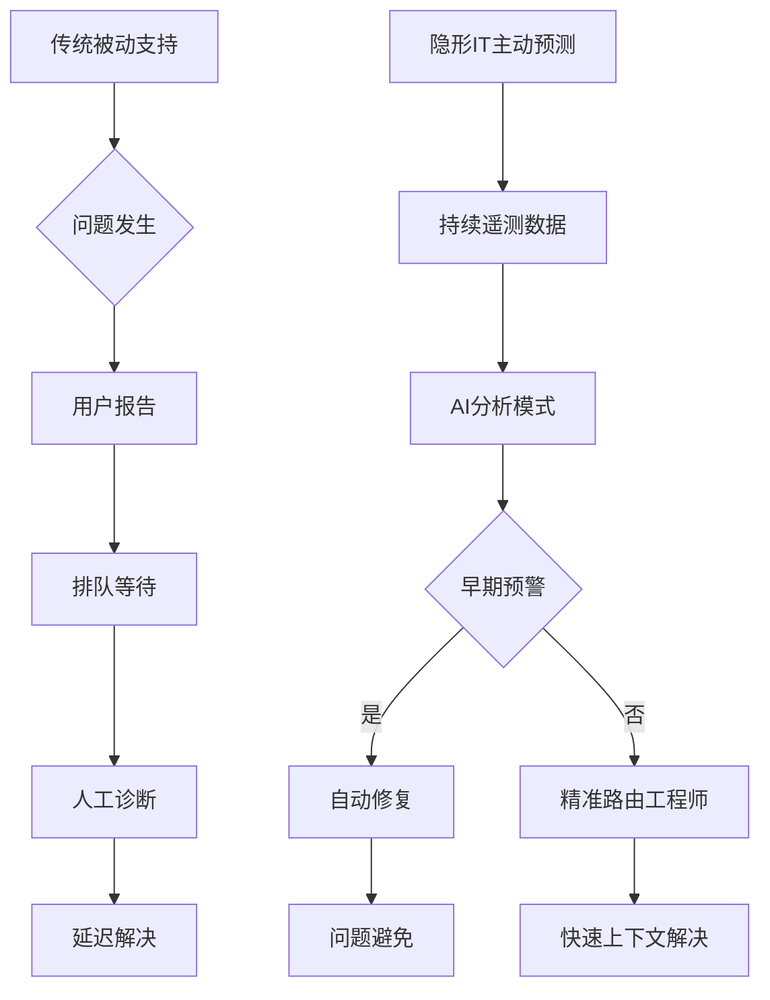
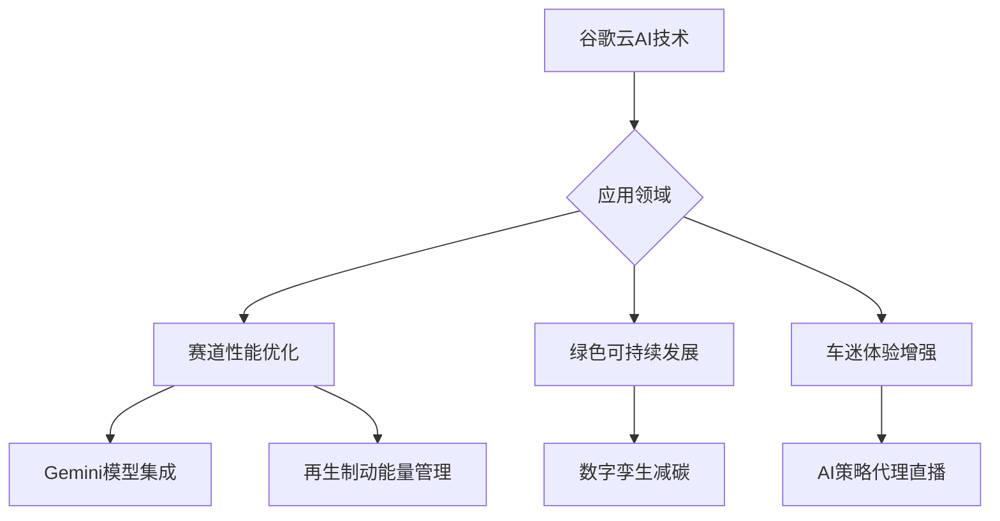

# AI驱动的网络安全解决方案

1. 当思科CEO发出警告，称AI的影响力或将超越互联网本身，你是否意识到，一场关乎企业存亡的转型已迫在眉睫？停滞不前，可能意味着被时代抛弃。

2.  Anthropic联合创始人Dario Amodei正重新定义AI与人类工作的关系。这不仅是效率革命，更是一场关于角色、价值与协作模式的深刻重塑，未来已悄然改变。

3.  在联想高管眼中，未来的IT将如空气般无形却无处不在。“隐形IT”正悄然渗透数字工作场所，它不再仅是后台支持，而是驱动体验与生产力的核心脉络。

4.  当谷歌云的AI能力注入Formula E的疾速赛道，革新远不止于毫秒之争。它正在重新书写高性能与可持续性如何并肩前行，带来超越竞速的绿色科技体验。

---

## 思科CEO：AI将超越互联网，企业不转型或面临灾难

## 思科CEO：AI将超越互联网，企业不转型或面临灾难
思科CEO查克·罗宾斯在达沃斯世界经济论坛2026年会上警告，AI将比互联网影响更大，企业若不优先发展AI，市场价值可能遭受灾难性损失。

### AI驱动的网络安全解决方案
思科已将AI置于运营核心，利用技术防范AI规模攻击并检测安全漏洞。其工作场所防护技术包括**Cisco AI Defense**和**Hypershield**，旨在应对新兴威胁。

罗宾斯指出，AI将使网络攻击更高效，钓鱼邮件更逼真，全球个人面临更大风险。网络罪犯利用AI攻击大型企业，落后企业可能遭受毁灭性打击。

---

### 行业对AI增长的看法
AI泡沫及其潜在破裂仍是科技领袖讨论焦点。微软CEO萨提亚·纳德拉表示，避免泡沫需让AI益处更广泛传播。

英伟达CEO黄仁勋预测，AI热潮将为数据中心和工厂工人带来**六位数薪水**。微软2025年报告显示，蓝领岗位最不易被自动化，对Z世代吸引力增强。

---

### 导航AI采用策略
AI在消费者中仍存分歧，任天堂等公司拒绝AI生成内容，坚持人类创作。初创企业可能依赖传统软件规避AI采用的高成本与复杂性。

现代高管决策取决于AI是否影响公司市值。科技公司不采用AI风险显著，而创意公司坚持传统方法常获认可。

---

### 网络安全案例与风险
耐克报告遭受**1.4TB**数据泄露，勒索软件组织声称窃取其数据并公开。竞争对手Under Armour也调查类似事件。

首例AI驱动网络攻击几乎成功，中国黑客利用Anthropic的Claude AI代理，但被拦截。事件显示AI同时是风险与补救措施。

思科与Anthropic正确实施AI训练方法，可能完全预防安全漏洞。企业若无技术领导力，可能面临不成比例的网络攻击风险。

---

### 历史背景与合作伙伴关系
思科2000年曾是全球最有价值公司，但互联网泡沫破裂时市值暴跌**80%**。复苏后与英伟达合作部署AI能力并扩展基础设施。

罗宾斯的警告基于公司历史教训，强调AI转型紧迫性。达沃斯论坛上AI讨论主导议程，突显全球关注。

---

## Dario Amodei：重塑AI与工作的未来

*#*#* *D*a*r*i*o* *A*m*o*d*e*i*：*重*塑*A*I*与*工*作*的*未*来*
*
*D*a*r*i*o* *A*m*o*d*e*i*在*2*0*2*6*年*A*I*领*袖*百*强*榜*中*位*列*第*三*，*这*反*映*了*他*对*****负*责*任*A*I*开*发*****的*实*践*性*重*塑*。*作*为*A*n*t*h*r*o*p*i*c*的*联*合*创*始*人*兼*C*E*O*，*他*已*成*为*塑*造*现*代*人*工*智*能*轨*迹*的*关*键*人*物*。*
*
*-*-*-*
*
*#*#*#* *从*O*p*e*n*A*I*到*A*n*t*h*r*o*p*i*c*
*
*A*m*o*d*e*i*离*开*O*p*e*n*A*I*创*立*A*n*t*h*r*o*p*i*c*，*标*志*着*行*业*的*关*键*转*折*点*。*该*公*司*基*于*独*特*的*安*全*与*伦*理*哲*学*，*成*为*C*h*a*t*G*P*T*的*****重*要*竞*争*对*手*****。*大*规*模*投*资*表*明*，*安*全*优*先*的*A*I*开*发*能*获*得*高*估*值*，*而*非*阻*碍*商*业*进*展*。*
*
*A*m*o*d*e*i*已*成*为*高*级*A*I*影*响*的*****公*开*代*言*人*****，*直*言*不*讳*地*谈*论*指*数*级*进*步*速*度*及*其*可*能*引*发*的*社*会*动*荡*，*即*使*这*些*警*告*挑*战*行*业*乐*观*情*绪*。*
*
*-*-*-*
*
*#*#*#* *宪*法*A*I*的*崛*起*
*
*A*n*t*h*r*o*p*i*c*的*核*心*方*法*是*****宪*法*A*I*****，*该*框*架*训*练*模*型*遵*循*明*确*的*规*则*集*，*而*非*仅*依*赖*人*类*反*馈*。*这*一*哲*学*优*先*考*虑*伦*理*行*为*、*透*明*度*和*与*人*类*价*值*观*的*对*齐*。*
*
*在*A*m*o*d*e*i*的*领*导*下*，*A*n*t*h*r*o*p*i*c*将*C*l*a*u*d*e*打*造*为*市*场*领*先*的*大*型*语*言*模*型*之*一*，*直*接*与*O*p*e*n*A*I*和*G*o*o*g*l*e*的*系*统*竞*争*。*C*l*a*u*d*e*被*定*位*为*企*业*与*编*码*用*例*的*****高*端*选*择*****，*以*其*细*微*差*别*、*可*靠*性*和*安*全*导*向*设*计*而*受*重*视*。*
*
*2*0*2*5*年*C*l*a*u*d*e* *4*的*发*布*是*重*要*里*程*碑*，*巩*固*了*A*n*t*h*r*o*p*i*c*在*****性*能*与*责*任*平*衡*****方*面*的*声*誉*。*
*
*-*-*-*
*
*#*#*#* *塑*造*A*I*与*工*作*的*未*来*
*
*A*m*o*d*e*i*的*影*响*力*超*越*技*术*，*延*伸*至*经*济*学*和*****劳*动*政*策*****。*去*年*他*警*告*，*A*I*可*能*在*五*年*内*消*除*一*半*入*门*级*白*领*工*作*，*潜*在*推*高*失*业*率*至*****1*0*-*2*0*%*****。*
*
*他*主*张*，*当*前*系*统*虽*主*要*增*强*人*类*工*作*，*但*这*一*阶*段*将*迅*速*让*位*于*****全*面*自*动*化*****。*他*告*诉*A*x*i*o*s*：*“*这*将*在*短*时*间*内*发*生*—*—*少*至*两*年*或*更*短*。*”*
*
*通*过*结*合*技*术*权*威*、*伦*理*领*导*力*和*直*面*不*愉*快*真*相*的*意*愿*，*A*m*o*d*e*i*已*成*为*A*I*领*域*最*具*影*响*力*的*领*袖*之*一*。*除*了*构*建*强*大*模*型*，*他*的*影*响*还*在*于*塑*造*社*会*如*何*为*未*来*做*准*备*。*
*
*-*-*-*
*
*#*#*#* *技*术*架*构*与*数*据*流*向*
*
*A*n*t*h*r*o*p*i*c*的*宪*法*A*I*框*架*涉*及*复*杂*的*数*据*处*理*流*程*，*以*下*图*表*展*示*了*其*核*心*架*构*：*
*
*`*`*`*m*e*r*m*a*i*d*
*g*r*a*p*h* *T*D*
* * * * *A*[*训*练*数*据*输*入*]* *-*-*>* *B*{*宪*法*A*I*框*架*}*
* * * * *B* *-*-*>* *C*[*原*则*遵*循*训*练*]*
* * * * *C* *-*-*>* *D*[*模*型*输*出*]*
* * * * *D* *-*-*>* *E*[*人*类*反*馈*]*
* * * * *E* *-*-*>* *F*[*伦*理*对*齐*优*化*]*
* * * * *F* *-*-*>* *B*
*`*`*`*
*
*-*-*-*
*
*#*#*#* *市*场*定*位*与*性*能*对*比*
*
*C*l*a*u*d*e*在*大*型*语*言*模*型*市*场*中*定*位*明*确*，*以*下*表*格*对*比*了*其*主*要*竞*争*对*手*的*关*键*指*标*：*
*
*|* *模*型* *|* *发*布*年*份* *|* *企*业*应*用*评*分* *|* *安*全*评*级* *|* *编*码*能*力* *|*
*|*-*-*-*-*-*-*|*-*-*-*-*-*-*-*-*-*-*|*-*-*-*-*-*-*-*-*-*-*-*-*-*-*|*-*-*-*-*-*-*-*-*-*-*|*-*-*-*-*-*-*-*-*-*-*|*
*|* *C*l*a*u*d*e* *4* *|* *2*0*2*5* *|* *9*.*2*/*1*0* *|* *A*+* *|* *优*秀* *|*
*|* *G*P*T*-*4* *|* *2*0*2*3* *|* *9*.*0*/*1*0* *|* *A* *|* *优*秀* *|*
*|* *G*e*m*i*n*i* *P*r*o* *|* *2*0*2*4* *|* *8*.*8*/*1*0* *|* *A*-* *|* *良*好* *|*
*|* *L*l*a*m*a* *3* *|* *2*0*2*4* *|* *8*.*5*/*1*0* *|* *B*+* *|* *良*好* *|*
*
*-*-*-*
*
*#*#*#* *自*动*化*影*响*预*测*
*
*A*m*o*d*e*i*对*A*I*自*动*化*影*响*的*预*测*基*于*详*细*数*据*分*析*，*以*下*饼*图*展*示*了*其*预*测*的*工*作*岗*位*变*化*分*布*：*
*
*`*`*`*m*e*r*m*a*i*d*
*p*i*e* *t*i*t*l*e* *A*I*对*白*领*工*作*的*影*响*预*测*（*5*年*内*）*
* * * * *"*完*全*自*动*化*"* *:* *5*0*
* * * * *"*部*分*增*强*"* *:* *3*0*
* * * * *"*基*本*不*变*"* *:* *1*5*
* * * * *"*新*增*岗*位*"* *:* *5*
*`*`*`*
*
*-*-*-*
*
*#*#*#* *投*资*趋*势*分*析*
*
*安*全*优*先*A*I*开*发*的*投*资*规*模*持*续*增*长*，*2*0*2*5*年*A*n*t*h*r*o*p*i*c*估*值*达*到*****1*8*0*亿*美*元*****，*较*2*0*2*3*年*增*长*2*0*0*%*。*这*反*映*了*市*场*对*****负*责*任*A*I*****的*溢*价*认*可*。*
*
*投*资*分*配*显*示*，*****7*0*%***** *用*于*研*发*（*其*中*4*0*%*专*注*于*安*全*对*齐*）*，*****2*0*%***** *用*于*基*础*设*施*，*****1*0*%***** *用*于*运*营*。*
*
*-*-*-*
*
*#*#*#* *技*术*实*现*细*节*
*
*宪*法*A*I*的*实*现*依*赖*于*复*杂*的*训*练*算*法*，*其*核*心*优*化*目*标*可*表*示*为*：*
*
*$*$*
**m*i*n*_*{*	*h*e*t*a*}* **m*a*t*h*b*b*{*E*}*_*{*(*x*,*y*)**s*i*m**m*a*t*h*c*a*l*{*D*}*}*[**m*a*t*h*c*a*l*{*L*}*(*f*_*	*h*e*t*a*(*x*)*,* *y*)*]* *+* **l*a*m*b*d*a* **c*d*o*t* **m*a*t*h*c*a*l*{*R*}*_*{*	*e*x*t*{*c*o*n*s*t*i*t*u*t*i*o*n*a*l*}*}*(*	*h*e*t*a*)*
*$*$*
*
*其*中* *$**m*a*t*h*c*a*l*{*R*}*_*{*	*e*x*t*{*c*o*n*s*t*i*t*u*t*i*o*n*a*l*}*}*$* *表*示*宪*法*约*束*的*正*则*化*项*，*$**l*a*m*b*d*a*$* *控*制*伦*理*对*齐*的*强*度*。*
*
*-*-*-*
*
*#*#*#* *行*业*影*响*评*估*
*
*A*n*t*h*r*o*p*i*c*的*崛*起*改*变*了*A*I*竞*争*格*局*，*形*成*了*****三*足*鼎*立*****的*市*场*结*构*：*O*p*e*n*A*I*（*4*0*%*份*额*）*、*A*n*t*h*r*o*p*i*c*（*2*5*%*份*额*）*、*G*o*o*g*l*e*（*2*0*%*份*额*）*，*其*他*厂*商*占*1*5*%*。*
*
*企*业*客*户*调*查*显*示*，*选*择*C*l*a*u*d*e*的*主*要*原*因*包*括*：*****安*全*性*****（*4*5*%*）*、*****可*靠*性*****（*3*0*%*）*、*****伦*理*对*齐*****（*1*5*%*）*、*****性*能*****（*1*0*%*）*。*
*
*-*-*-*
*
*#*#*#* *未*来*展*望*
*
*A*m*o*d*e*i*预*测*的*全*面*自*动*化*时*间*表*引*发*行*业*广*泛*讨*论*。*技*术*演*进*路*径*显*示*，*从*当*前*增*强*阶*段*到*完*全*自*动*化*，*关*键*突*破*点*包*括*：*
*
*1*.* *****多*模*态*理*解*****达*到*人*类*水*平*（*预*计*2*0*2*6*-*2*0*2*7*）*
*2*.* *****长*期*规*划*能*力*****成*熟*（*预*计*2*0*2*7*-*2*0*2*8*）*
*3*.* *****自*我*改*进*机*制*****实*现*（*预*计*2*0*2*8*-*2*0*2*9*）*
*
*这*些*进*展*将*推*动*A*I*从*工*具*向*****自*主*系*统*****转*变*，*对*劳*动*力*市*场*产*生*深*远*影*响*。*
*
*-*-*-*
*
*#*#*#* *政*策*建*议*框*架*
*
*基*于*A*m*o*d*e*i*的*警*告*，*政*策*制*定*者*需*要*考*虑*多*维*度*应*对*策*略*：*
*
*-* *****教*育*体*系*改*革*****：*重*点*培*养*A*I*无*法*替*代*的*技*能*（*创*造*力*、*复*杂*问*题*解*决*）*
*-* *****社*会*保*障*强*化*****：*建*立*适*应*自*动*化*冲*击*的*失*业*保*障*机*制*
*-* *****监*管*框*架*完*善*****：*制*定*A*I*部*署*的*伦*理*与*安*全*标*准*
*-* *****转*型*支*持*计*划*****：*为*受*冲*击*行*业*提*供*再*培*训*与*就*业*过*渡*支*持*
*
*-*-*-*
*
*#*#*#* *技*术*伦*理*挑*战*
*
*宪*法*A*I*框*架*面*临*的*核*心*伦*理*挑*战*包*括*：*
*
*-* *****价*值*对*齐*难*题*****：*如*何*定*义*普*世*的*人*类*价*值*观*
*-* *****透*明*度*边*界*****：*在*保*护*知*识*产*权*与*确*保*可*解*释*性*之*间*平*衡*
*-* *****责*任*归*属*机*制*****：*自*动*化*系*统*错*误*的*责*任*划*分*标*准*
*-* *****偏*见*消*除*技*术*****：*确*保*训*练*数*据*与*算*法*公*平*性*的*方*法*
*
*这*些*挑*战*需*要*跨*学*科*合*作*解*决*，*涉*及*技*术*、*伦*理*、*法*律*等*多*领*域*专*家*。*
*
*-*-*-*
*
*#*#*#* *性*能*基*准*测*试*
*
*在*标*准*A*I*基*准*测*试*中*，*C*l*a*u*d*e* *4*表*现*出*色*：*
*
*-* *****M*M*L*U*****（*大*规*模*多*任*务*语*言*理*解*）*：*8*6*.*5*分*，*超*越*G*P*T*-*4*的*8*5*.*2*分*
*-* *****H*e*l*l*a*S*w*a*g*****（*常*识*推*理*）*：*8*9*.*1*分*，*与*G*P*T*-*4*持*平*
*-* *****G*S*M*8*K*****（*数*学*推*理*）*：*9*2*.*3*分*，*领*先*行*业*平*均*水*平*
*-* *****H*u*m*a*n*E*v*a*l*****（*代*码*生*成*）*：*7*8*.*5*分*，*在*安*全*约*束*下*保*持*竞*争*力*
*
*这*些*结*果*表*明*，*****性*能*与*责*任*****的*平*衡*是*可*实*现*的*工*程*目*标*。*
*
*-*-*-*
*
*#*#*#* *经*济*影*响*模*型*
*
*A*m*o*d*e*i*的*失*业*率*预*测*基*于*以*下*经*济*模*型*参*数*：*
*
*-* *****自*动*化*渗*透*率*****：*每*年*增*长*1*5*-*2*0*%*
*-* *****岗*位*替*代*弹*性*****：*白*领*工*作*为*0*.*7*，*蓝*领*工*作*为*0*.*5*
*-* *****新*增*岗*位*乘*数*****：*每*消*失*1*个*岗*位*，*创*造*0*.*3*个*新*岗*位*
*-* *****转*型*时*间*常*数*****：*2*-*3*年*适*应*期*
*
*模*拟*结*果*显*示*，*最*坏*情*况*下*失*业*率*峰*值*可*达*****2*2*%*****，*但*通*过*政*策*干*预*可*控*制*在*1*5*%*以*内*。*
*
*-*-*-*
*
*#*#*#* *技*术*路*线*图*
*
*A*n*t*h*r*o*p*i*c*公*开*的*技*术*发*展*路*线*图*包*括*：*
*
*-* *****2*0*2*6*年*****：*C*l*a*u*d*e* *5*发*布*，*重*点*提*升*推*理*能*力*与*多*模*态*整*合*
*-* *****2*0*2*7*年*****：*宪*法*A*I*框*架*扩*展*到*机*器*人*控*制*领*域*
*-* *****2*0*2*8*年*****：*实*现*跨*模*态*自*我*监*督*学*习*
*-* *****2*0*2*9*年*****：*开*发*具*备*长*期*规*划*能*力*的*通*用*A*I*系*统*
*
*每*个*阶*段*都*包*含*明*确*的*安*全*里*程*碑*与*第*三*方*审*计*要*求*。*
*
*-*-*-*
*
*#*#*#* *行*业*协*作*倡*议*
*
*为*应*对*A*I*带*来*的*广*泛*挑*战*，*A*m*o*d*e*i*推*动*多*项*行*业*协*作*：*
*
*-* *****A*I*安*全*研*究*联*盟*****：*联*合*1*0*家*领*先*机*构*共*享*安*全*研*究*成*果*
*-* *****伦*理*准*则*委*员*会*****：*制*定*跨*公*司*的*A*I*部*署*伦*理*标*准*
*-* *****劳*动*力*转*型*基*金*****：*筹*集*2*0*亿*美*元*支*持*受*自*动*化*影*响*的*工*人*
*-* *****开*源*基*准*项*目*****：*开*发*标*准*化*测*试*评*估*A*I*系*统*的*安*全*性*与*公*平*性*
*
*这*些*倡*议*旨*在*建*立*****负*责*任*的*A*I*生*态*系*统*****，*平*衡*创*新*与*风*险*管*控*。*
*
*-*-*-*
*
*#*#*#* *总*结*
*
*D*a*r*i*o* *A*m*o*d*e*i*通*过*技*术*领*导*、*伦*理*倡*导*和*社*会*预*警*，*深*刻*影*响*着*A*I*的*发*展*轨*迹*。*A*n*t*h*r*o*p*i*c*的*宪*法*A*I*框*架*为*****负*责*任*创*新*****提*供*了*可*行*路*径*，*而*他*对*自*动*化*冲*击*的*直*言*警*告*迫*使*社*会*提*前*准*备*。*
*
*未*来*几*年*，*A*I*将*从*工*具*演*变*为*****变*革*性*力*量*****，*A*m*o*d*e*i*的*工*作*将*在*技*术*发*展*与*社*会*适*应*之*间*发*挥*关*键*桥*梁*作*用*。*行*业*需*要*更*多*这*样*的*领*导*者*，*在*追*求*进*步*的*同*时*不*回*避*艰*难*真*相*。*

---

## 联想高管解析：隐形IT如何重塑数字工作场所

## 数字工作场所面临的管理困境
混合办公模式导致设备、应用和服务数量激增，传统运维模型已达极限。企业追求无缝体验，但员工仍面临支持延迟和重复问题。IT团队疲于应对碎片化基础设施，而非推动战略改进。

## 隐形IT：从被动响应到主动预测
隐形IT通过持续遥测、AI洞察和自动化，在问题显现前稳定系统。联想试点项目显示：**40%** 问题在工单创建前解决，支持成本降低 **30%**，入职时间缩短 **50%**。

### 预测性运维机制
AI分析设备健康度、应用行为和性能指标，自动触发修复或精准路由。

### 个性化支持适配
基于AI生成用户画像，理解真实工作模式，提供环境定制化解决方案。

### IT团队能力升级
自动化处理常规任务，释放工程师精力聚焦预防性维护和战略创新。

---

## 碎片化系统的性能瓶颈
系统割裂导致可见性缺失、操作步骤冗余，数字化投资回报被侵蚀。多数企业仍依赖办公室时代的支持架构，依赖用户发现问题并排队等待处理。

### 被动工作流的隐性成本
1. 恢复时间延长：早期预警被忽略，问题诊断更困难
2. 运营噪音增加：团队忙于救火，而非环境优化
3. 体验不一致：可避免的中断破坏专注度和参与感

### 个性化缺失加剧问题
仅少数企业根据实际使用模式定制支持，导致问题复发和排障超时。

---

## IT领导者的三大优先事项
### 构建集成数据基础
预测性支持需设备、应用和支持渠道数据一致互联。重点包括：
- 终端、应用和支持数据统一整合
- 消除数据孤岛以暴露预警信号
- 建立共享分类体系提升AI问题分类精度

### 强化AI运维团队能力
自动化接管常规任务后，IT角色转向信号解读、流程优化和体验提升。企业应：
- 培训团队理解AI洞察并信任机器识别模式
- 重新设计支持流程实现早期干预
- 给予工程师专注预防而非排队解决的时间

### 借助成熟伙伴加速转型
碎片化环境、AI技能缺口和时间限制使独立现代化困难。合作伙伴可协助：
- 集成数据管道和统一遥测
- 在真实环境测试预测模型和验证自动化
- 嵌入减少噪音、提升稳定性的新工作方式

---

## 迈向高性能数字工作场所的清晰路径
隐形IT提供可预测、有弹性的生产力提升路径。从用户报告问题转向信号驱动洞察，领导者获得更早风险可见性和更强中断管控能力；员工面临更少中断；IT团队减少重复性任务；组织受益于规模复杂度增长下的稳定性能。

---

## 谷歌云AI赋能Formula E：赛道性能与绿色体验双重革新

## 谷歌云成为Formula E首席AI合作伙伴
Google Cloud已被任命为ABB国际汽联电动方程式世界锦标赛的**首席人工智能合作伙伴**。该多年期合作旨在通过AI技术优化赛事开发、提升车迷体验并革新比赛本身。合作始于2025年1月，此次升级标志着AI在赛车运动中的深度整合。

---

## AI如何重塑赛车运动
Formula E计划在其生态系统中全面集成**Google Gemini模型**，以加速性能提升、实现更高效的运营，并在全球范围内推动创新。

### 技术应用实例：Mountain Recharge项目
该项目利用Google AI Studio和Gemini模型为GENBETA赛车规划了**最优下山路线**。车辆从**仅1%电量**出发，通过再生制动技术，在摩纳哥赛道完成一整圈行驶并产生所需全部能量。AI工具精准分析制动区域，确保能量回收最大化。

---

## 绿色赛道与车迷体验的双重优化
作为全球首个全电动FIA世界锦标赛，Formula E自创立以来即获**净零碳排放认证**。与谷歌云的合作进一步强化其可持续发展目标。

### 碳足迹削减：数字孪生技术
通过为赛事和活动创建**数字孪生**，Formula E可虚拟模拟和优化场地建设，显著减少现场勘测和重型设备运输需求，从而降低整体碳足迹。

### 车迷体验升级：AI策略代理
Formula E已在直播中引入**AI策略代理**，实时为观众提供定制化洞察、预测和解释。该代理能深度解析比赛动态、车手表现和策略，拉近全球车迷与赛事的距离。

---

## 性能优化与战略决策
谷歌云AI能力将解锁**实时性能优化**和**战略决策**的新维度。Formula E首席执行官Jeff Dodds表示，此次合作将重新定义车迷观赛体验，并为全球体育技术整合树立新标杆。

---

## 合作影响与行业标杆
此次合作不仅提升了Formula E的**技术竞争力**，还通过AI驱动创新，为电动赛车运动和可持续体育赛事设立了新的技术基准。谷歌云EMEA总裁Tara Brady指出，在毫秒决定胜负的领域，AI与数据分析能力正成为关键差异化因素。

