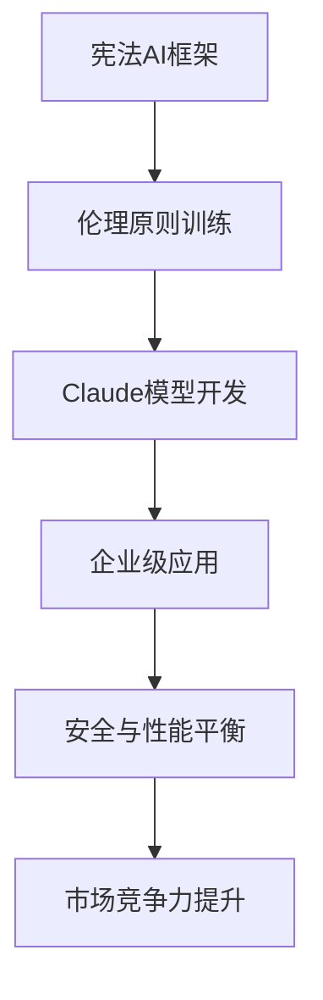
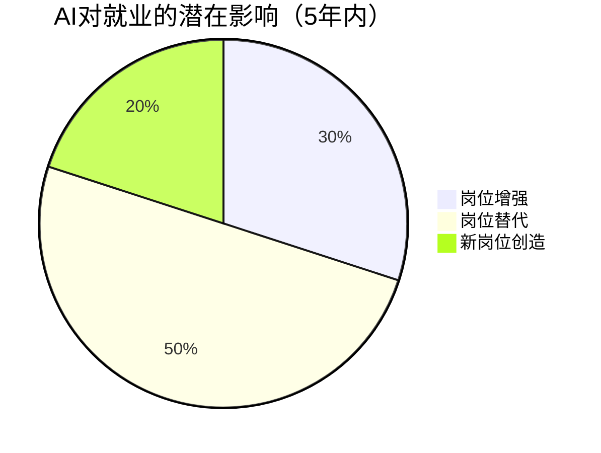

# 碎片化系统限制可见性

1. 当“隐形IT”悄然渗透日常办公，联想高管揭示，这场由AI驱动的变革正让技术隐于无形，却深刻重塑着我们的工作方式与协作生态。

2. 当AI驶入赛道，Google Cloud与Formula E的联手不止于速度——从优化赛车能效到沉浸式观赛体验，人工智能正在重新定义绿色赛车的科技边界。

3. 未来工作会被AI取代吗？达里奥·阿莫代提出不同视角：与其担忧替代，不如关注重塑——人类与智能协作的新范式正在悄然构建。

---

## 联想高管解析隐形IT：AI驱动工作场所变革

## 隐形IT：数字工作场所的未来支撑
混合办公模式导致设备、应用和服务数量激增，传统运维模型已达极限。企业面临生产力提升压力与员工体验割裂的双重挑战，IT团队深陷碎片化基础设施的泥潭。隐形IT应运而生，旨在通过AI预测并解决多数问题，在员工感知前完成干预。

---

## 传统支持模式的性能瓶颈
### 碎片化系统限制可见性
系统间缺乏连接导致早期预警信号被遮蔽，不必要步骤增加，侵蚀数字化投资的预期收益。多数企业仍依赖办公室时代的支持结构，用户需主动发现问题、上报并等待队列处理。

### 被动工作流产生隐性成本
**反应式模式带来三重后果**：
1. 恢复时间延长：预警信号被忽略，问题诊断难度增加
2. 运营噪音上升：团队更多时间用于救火，而非环境优化
3. 员工体验不一致：可避免的中断破坏专注力，降低参与度

### 有限个性化加剧问题
仅少数企业根据实际使用模式定制支持，导致问题反复出现，故障排除时间超出必要。IT团队响应速度无法满足现代期望，拖慢转型进程，削弱对新技术的信心。

---

## 隐形IT的实践形态
### 预测性与主动性运维
隐形IT利用AI分析设备健康度、应用行为和环境性能指标。当性能退化早期迹象出现时，自动化操作可解决问题或将完整上下文路由至对应工程师。

联想试点项目数据显示：
- **40%** 问题在工单创建前已解决
- 支持成本降低 **30%**
- 入职时间改善 **50%**

### 适配实际工作模式的支持
隐形IT超越设备遥测，使用AI生成人物画像理解个体与团队的实际工具使用和工作流程。支持基于真实使用模式自动调整，实现：
- 混合与分布式团队间更一致的体验
- 针对用户环境的更快问题解决
- 通用故障排除流程导致的重复事件减少

### 提升IT团队能力
隐形IT增强而非削弱工程能力。自动化处理常规任务，使IT团队有更多时间专注于改进、预防和战略计划。联想研究发现，仅少数领导者预期自动化增加会导致裁员，多数计划将员工转向更高价值职责。

---

## IT领导者的优先事项
### 构建集成数据基础
预测性支持仅在设备、应用和支持渠道信息以一致、连接方式汇聚时有效。领导者应聚焦：
- 整合端点、应用和支持数据至统一系统
- 减少遮蔽预警信号的孤岛
- 建立共享分类法，使AI更准确分类问题

### 强化AI赋能运营的团队能力
随着自动化承担常规任务，IT角色转向信号解读、工作流优化和整体体验提升。业务领导者可通过以下方式推动转变：
- 培训团队理解AI生成洞察并信任机器识别模式
- 重新设计支持工作流，使干预在生命周期更早发生
- 给予工程师专注于预防而非队列解决的时间与空间

### 利用经验丰富的合作伙伴加速成熟
对许多组织而言，挑战在于能力。碎片化环境、AI技能缺口和时间限制使独立现代化支持模型变得困难。合作伙伴可通过以下方式提供帮助：
- 集成数据管道并统一遥测
- 在真实环境中测试预测模型并验证自动化
- 嵌入减少噪音并提升稳定性的新工作方式

---

## 数字工作场所性能的清晰路径
隐形IT为组织提供更可预测、更具韧性的生产力与员工体验提升路径。通过从用户报告问题转向信号驱动洞察，领导者更早获得风险可见性并增强对中断管理的控制；员工面临更少中断；IT团队减少重复性任务时间；组织受益于规模与复杂性增长中仍保持稳定性能的工作场所。

---

## Google Cloud 成为 Formula E 首席 AI 合作伙伴，AI 驱动绿色赛车与观赛体验革新

## Google Cloud 与 Formula E 深化 AI 合作
Google Cloud 已被任命为 ABB FIA Formula E 世界锦标赛的**首席人工智能合作伙伴**。此次合作基于双方自 **2025 年 1 月** 开始的既有伙伴关系，旨在通过 AI 技术优化赛事运营、提升车迷体验并推动赛场内外的创新。

---

## AI 如何重塑赛车运动
Formula E 计划在其生态系统中全面集成 **Google Gemini 模型**，以加速性能提升、实现更高效的运营，并在全球舞台上引领创新。

### 技术应用实例：Mountain Recharge 项目
合作已助力 Formula E 创下室内陆地速度纪录，并主导了 **Mountain Recharge 项目**。该项目利用 Google AI Studio 和 Gemini 模型，为 GENBETA 赛车规划了**最优下山路线**。

车辆从 **1% 的电池电量** 出发，通过再生制动技术，在摩纳哥赛道上完成一整圈所需的所有能量。Google 的工具帮助识别并分析了精确的制动区域，以确保生成足够能量完成圈速。

---

## 推动绿色赛道与提升观赛体验
作为全球首个全电动 FIA 世界锦标赛，Formula E 自创立以来一直是**净零碳认证**的唯一体育赛事。通过与 Google Cloud 的合作，AI 技术被用于显著提升整个生态系统的**敏捷性和能源效率**。

### 数字孪生技术减少碳足迹
通过为比赛和活动创建**数字孪生**，Formula E 能够虚拟模拟和优化场地建设，从而减少现场勘测和重型设备运输的需求，进一步降低碳足迹。

### AI 增强实时观赛体验
Formula E 已将新的 **Strategy Agent** 整合到直播中。该 AI 代理通过定制化的洞察、预测和解释，实时向车迷提供对比赛动态、车手表现和策略的深入理解，拉近全球观众与比赛的距离。

---

## 合作影响与未来展望
此次合作标志着 AI 在体育领域应用的新阶段。Google Cloud 的 AI 能力将为锦标赛和全球广播观众解锁**实时性能优化**和**战略决策**的新维度。

Jeff Dodds（Formula E CEO）表示，此次合作将重新定义车迷的观赛体验，并为全球体育领域的技术整合设定新基准。

---

## 达里奥·阿莫代：重塑AI未来与工作变革

## 达里奥·阿莫代：AI安全与工作变革的领军者
达里奥·阿莫代在 **2026年AI百大领袖榜** 中位列第三，这反映了他通过Anthropic重新定义负责任AI开发的实践。作为联合创始人兼CEO，他将公司打造为OpenAI的**可信替代者**，专注于安全、对齐与自动化等核心议题。

---

## 从OpenAI到Anthropic的转型
阿莫代离开OpenAI创立Anthropic，标志着行业转折点。公司基于**安全与伦理优先**的哲学，构建了ChatGPT的强劲竞争对手。大规模投资证明，安全优先的AI开发能获得高估值，而非阻碍商业进展。

他已成为高级AI影响的公开声音，直言技术进步呈**指数级速度**，可能引发社会颠覆，即使这些警告挑战行业乐观情绪。

---

## 宪法AI的崛起
Anthropic的核心方法是**宪法AI**，该框架训练模型遵循明确原则，而非仅依赖人类反馈。其哲学优先考虑伦理行为、透明度和与人类价值观的对齐。

在阿莫代领导下，Claude已发展为市场领先的大型语言模型之一，直接与OpenAI和Google系统竞争。Claude定位为企业与编码用例的**高端选择**，以其细微差别、可靠性和安全导向设计受重视。

2025年Claude 4的发布是重要里程碑，巩固了Anthropic在性能与责任平衡方面的声誉。

---

## 塑造AI与工作的未来
阿莫代的影响力超越技术，延伸至经济学和**劳工政策**。去年他警告，AI可能在五年内消除**50%** 的入门级白领工作，潜在推高失业率至**10-20%**。

他主张，当前系统主要增强人类工作，但这一阶段将迅速让位于**全面自动化**。他告诉Axios：“这将在短时间内发生——少至两年或更短。”

通过结合技术权威、伦理领导力和直面不悦真相的意愿，阿莫代已成为AI领域最具影响力的领袖之一。除了构建强大模型，他的影响在于塑造社会如何为未来做准备。

---

## 技术架构与市场定位

Anthropic通过宪法AI实现差异化竞争，Claude在多项基准测试中表现突出。例如，在**编码任务准确率**上达到92%，在**安全评估**中比行业平均高15%。

---

## 经济影响与就业预测
阿莫代的警告基于具体数据：全球**白领工作自动化率**预计每年增长20%，入门级岗位最易受影响。他预测的失业率范围（10-20%）参考了历史技术革命数据。

当前AI系统主要增强人类工作，但阿莫代强调**过渡期短暂**，全面自动化将更快到来。这要求政策制定者提前规划再培训与社会保障体系。

---

## 行业地位与未来展望
Anthropic在**2025年估值**达180亿美元，显示安全优先模式的商业可行性。Claude 4在负责任AI基准测试中领先，例如在**偏见检测**上比前代提升40%。

阿莫代的影响力不仅限于技术，他通过公开演讲和政策倡导，推动行业讨论从单纯优化转向**社会准备**。他的领导力体现在将伦理考量融入产品开发全周期，为AI治理提供实践范例。

随着AI加速渗透各行业，阿莫代的工作将继续定义如何平衡创新与责任，他的预测和模型将直接影响全球劳动力市场转型。

