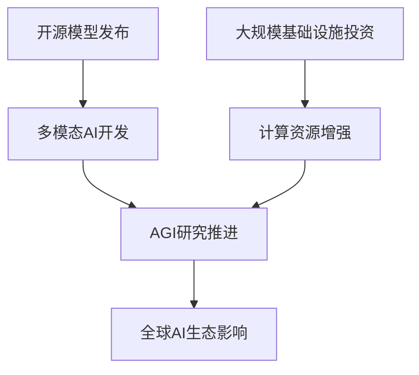
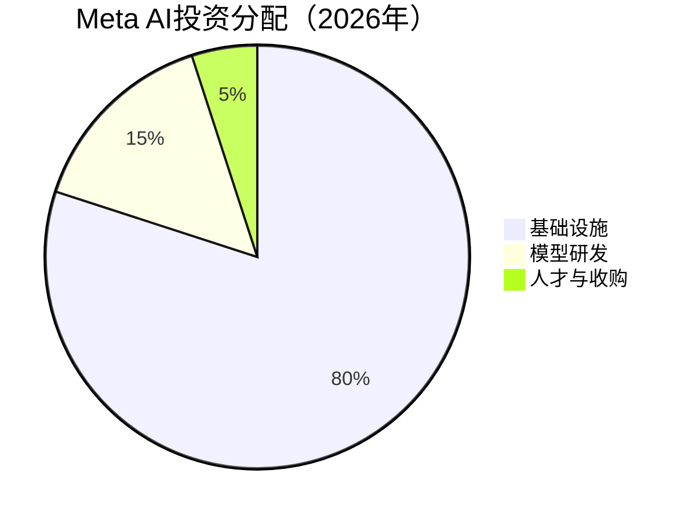

# 扎克伯格引领Meta开源AI与超级智能战略

1. 当扎克伯格宣布Meta将全力押注开源AI并追求“超级智能”，科技界的目光再次聚焦。这不仅是技术路径的选择，更可能重塑行业竞争格局与AI民主化的未来。

2. 在金融业AI竞赛中，花旗集团选择了一条与众不同的路：不是急于部署尖端模型，而是从全员AI素养与伦理框架筑基。这场自上而下的“思维转型”，或许揭示了传统巨头拥抱AI的真正关键。

3. Pinterest首席产品官突然离职，背后是公司AI战略的激进转向。从灵感平台到购物引擎，这家公司正试图用AI重新连接年轻用户与消费决策，这场变革将如何改写社交电商的玩法？

---

## 扎克伯格引领Meta开源AI与超级智能战略

## 扎克伯格跻身AI领袖前列
马克·扎克伯格在《AI杂志》2026年百大领袖榜单中排名第**6**，凸显其在全球AI竞赛中的影响力。作为Meta首席执行官，他正推动公司聚焦开源创新、多模态AI开发及人工通用智能（AGI）的追求。

---

## 推动开源AI革命
2025年，Meta发布第四代Llama大语言模型家族，包括Scout、Maverick及预览版Behemoth。这些模型支持文本、图像、视频和音频的多模态处理，适用于企业应用与内容创作。通过开源策略，Meta与依赖付费墙的竞争对手形成差异化，旨在加速创新并扩大开发者可及性。

---

## 超级智能与大规模投资
Meta积极布局AGI，战略包括对Scale AI的**143亿美元**股权投资，并将创始人Alexandr Wang引入高层。公司计划一年内投入高达**1350亿美元**用于AI基础设施，尽管面临AI泡沫警告，扎克伯格仍坚持激进投资，视AI为下一代决定性技术。

---

## 技术架构与数据流向
Meta的AI战略核心围绕开源模型与基础设施投资，其技术架构可简化为以下流程：

---

## 投资分配分析
Meta的AI投资主要集中于基础设施与模型研发，具体比例如下：

---

## 竞争格局与影响
扎克伯格的领导使Meta能与OpenAI、Google和Anthropic等巨头直接竞争。其影响力超越公司层面，正塑造AI在全球经济中的构建、共享与部署方式，推动行业向更开放、可访问的方向发展。

---

## 花旗集团AI战略：全员培训与伦理框架驱动转型

## 花旗集团AI全员培训计划
花旗集团CEO简·弗雷泽在达沃斯论坛表示，AI将创造大量新岗位并改变工作性质。公司已启动全员强制性AI培训，覆盖超过**17.5万**名员工，旨在消除技术恐惧并提升实操能力。

---

### 伦理原则优先于刚性规则
花旗采用基于伦理原则的AI使用框架，而非完全规则化系统。弗雷泽强调灵活性，让员工根据实际工作需求应用AI工具，重点在于提升工作效率和客户服务质量，而非追求技术新奇性。

---

### AI优先文化落地措施
2025年起，花旗为所有员工配备内部AI工具，将技术嵌入各层级而非仅限专业部门。此举与基础设施现代化计划同步，目标是通过AI提升运营效率与客户体验。

---

### 员工留存与职业发展
花旗**50%**的新职位由现有员工填补。弗雷泽以南达科他州分部为例，员工可通过AI实现职业重塑，平均在职30年期间经历12种不同岗位。公司通过赋予员工AI学习自主权，增强其对未来角色的透明度与掌控力。

---

### 行业背景与高管观点
世界经济论坛上，埃森哲朱莉·斯威特与Salesforce马克·贝尼奥夫均强调员工AI技能培训的重要性。弗雷泽指出，企业培训方式将决定AI带来的是机遇还是风险，核心在于让员工“掌握主动权”。

---

## Pinterest高管变动背后的AI战略：聚焦电商与年轻用户

## Pinterest高管变动背后的AI战略
Pinterest任命李·布朗为首席商务官、克劳丁·奇弗为首席营销官，旨在推进其成为全球AI驱动购物平台的战略。此次重组直接向CEO比尔·雷迪汇报，聚焦统一客户运营与扩大收入机会。

---

### 新的商业结构
李·布朗领导全球销售、广告、合作伙伴关系与内容团队，整合面向客户的业务部门。其经验包括在Spotify、DoorDash等公司通过深化客户关系将消费者需求转化为广告机会。此次任命伴随首席营收官比尔·沃特金斯离职，后者已在公司工作十多年。

---

### 用积极的AI塑造品牌
克劳丁·奇弗从亚马逊加入，负责完善Pinterest的市场叙事，扩展AI主导购物与电商的信息传递。她强调AI将用于自动化与个性化内容，确保用户体验“丰富有用”而非“毛骨悚然”。新营销活动将突出平台作为视觉发现与购物目的地。

---

### 触及年轻受众
Z世代在Pinterest全球用户中占比持续增长。平台已连续九个季度实现用户增长，全球月活跃用户超过**6亿**。CEO比尔·雷迪表示，重组旨在结合相关性、实用性与情感舒适度，通过AI连接发现与商业，推动货币化与全球增长。

---

#### 关键数据
- 月活跃用户：**6亿**
- 用户增长：连续9个季度
- 战略核心：AI驱动购物、效果广告平台
- 重点人群：Z世代年轻用户

---

## 结语

感谢您的阅读，我们将继续为您捕捉人工智能领域的每一个创新瞬间。

💬 你对本期哪个内容最感兴趣？欢迎在评论区交流心得！
⭐ 觉得文章不错？点个「在看」分享给同样热爱技术的伙伴们！

    

