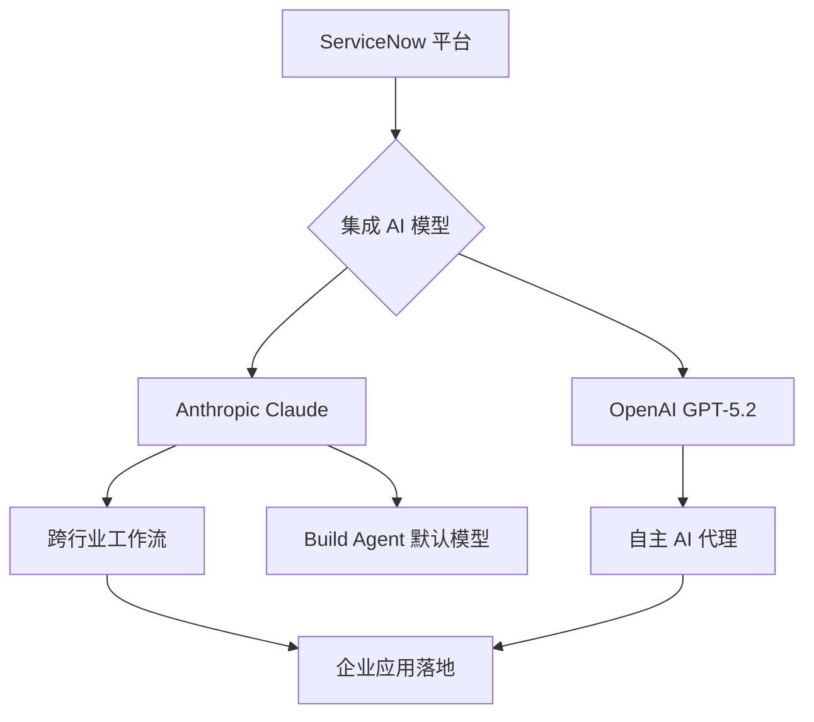

# 物理AI平台实现技术复用

**1.** 自动驾驶领域再掀波澜！Waabi 凭借其独特的 AI 平台，完成了高达 10 亿美元的 C 轮融资。这笔巨额投资不仅将加速其卡车自动驾驶技术的研发，更将拓展到出租车领域，预示着未来出行方式的变革。Waabi 如何利用 AI 同时赋能两种截然不同的交通工具？让我们一探究竟。

**2.** AI 浪潮下，金融巨头花旗集团也加入了变革的行列。他们正积极推行“AI 优先”的企业文化，不仅大力投资员工培训，更强调 AI 伦理的重要性。面对 AI 带来的机遇与挑战，花旗将如何平衡创新与责任？本文将深入解读花旗的 AI 战略。

**3.** 企业级 AI 应用再添新篇章！ServiceNow 宣布与 Anthropic 达成合作，将 Claude 模型集成到其平台中。这意味着企业用户将能够更便捷地利用 AI 提升效率、优化服务。ServiceNow 与 Anthropic 的强强联合，又将为行业带来哪些惊喜？让我们拭目以待。

**4.** Meta 的未来蓝图逐渐清晰：开源与超级智能成为两大关键词。在扎克伯格的带领下，Meta 不仅持续推动 AI 技术的开源共享，更将目光瞄准了更高阶的超级智能。Meta 的 AI 野心究竟有多大？又将如何影响整个科技行业？本文将为你揭晓。

---

## Waabi完成10亿美元C轮融资，AI平台将同时赋能卡车与出租车

自动驾驶公司Waabi宣布完成 **10亿美元** C轮融资，由 Khosla Ventures 和 G2 Venture Partners 共同领投，创下加拿大历史最高融资记录。本轮融资的战略投资者包括 NVIDIA 旗下 NVentures、沃尔沃集团风险投资以及保时捷汽车控股公司。

### 物理 AI 平台：技术复用的关键
Waabi 的核心技术是“物理人工智能平台”，它结合了可验证的端到端 AI 模型和神经模拟器。该平台已在自动驾驶卡车领域实现商业化，其技术架构允许相同的 AI 模型作为自动驾驶卡车和无人驾驶出租车的“共享大脑”，从而实现技术复用。

### 扩大合作：与 Uber 的深度绑定
Waabi 计划将其为卡车开发的 AI 平台应用于无人驾驶出租车（Robotaxi）领域，并深化与 Uber 的合作。Uber 将提供基于里程碑的追加投资，双方目标是部署 **25,000辆** 或更多自动驾驶汽车（AV）。此前，Waabi 已与 Uber Freight 展开合作，Uber 也参与了 Waabi 2024 年的 B 轮融资。

### 融资对比与技术优势
尽管 Waabi 的融资规模显著，但仍低于 Waymo 2024 年完成的 56 亿美元 C 轮融资。G2 Venture Partners 指出，Waabi 的“模拟优先、端到端 AI”方法能够加速商业应用，同时大幅降低规模化所需的资本支出。这种技术路径有望提高车辆效率和利用率，推动交通系统向更可持续的方向发展。

Waabi 的物理 AI 平台被设计为可推广至不同外形、地理位置和环境，这为其同时进入卡车和出租车市场提供了技术基础。

---

## 花旗集团推行AI优先文化：员工培训与道德原则并重

### 花旗集团的AI战略核心
花旗集团CEO Jane Fraser 认为，人工智能（AI）将带来颠覆性变革，创造当前无法想象的新岗位，并重塑日常工作性质。她强调，企业培训员工的方式将决定AI的最终影响。员工必须主动掌握AI技能，否则将被使用AI的同行超越。花旗将 AI 视为提高生产力、改善客户体验和降低风险的关键驱动力。

### 基于原则而非规则的AI治理
花旗集团在规模化应用AI时，引入了指导员工使用的道德原则框架。Fraser 倾向于使用原则而非僵化的规则来指导决策，以适应工作的人性化和复杂性。AI的应用重点在于提升员工效能和客户服务质量，而非盲目追求技术新颖性。这种方法旨在确保 AI 的部署符合道德标准，并服务于更广泛的业务目标。

### 全员强制性AI培训
为嵌入“AI优先”文化，花旗集团将员工培训提升至首要任务。自 2025 年起，公司开始为超过 **175,000** 名员工配备内部AI工具，并提供强制性培训，旨在消除员工对新技术的恐惧感。此举旨在将AI能力渗透到所有层级，而非仅限于专业部门，确保每位员工都能利用 AI 提升工作效率和创新能力。

### AI赋能员工职业重塑
Fraser 认为AI采纳有助于员工保留，公司一半以上的新职位由内部员工填补。她以南达科他州站点为例，员工平均拥有 **30** 年工龄并经历过 **12** 种不同职业。花旗的目标是利用AI帮助员工像过去一样实现自我重塑，赋予员工对AI学习的直接控制权，以增加未来职业发展的透明度。通过 AI 赋能，员工可以更好地适应变化，实现职业生涯的长期发展。

---

## ServiceNow与Anthropic达成AI合作，集成Claude模型

### ServiceNow 引入 Anthropic Claude 模型
ServiceNow 宣布与 Anthropic 达成合作协议，将 Anthropic 的 Claude 模型集成到其跨行业工作流程中，覆盖医疗保健和生命科学等领域。此举标志着 Anthropic 进一步深入企业级 AI 市场。

### 默认模型与自主代理构建
根据协议，Claude 将成为 ServiceNow 的 AI 代理构建器 **ServiceNow Build Agent** 的默认模型。该工具旨在使不同技能水平的开发者能够创建和部署具备自主行动和推理能力的代理工作流，聚焦于代理 AI 和自主运营。

### 内部员工与编码助手部署
此次合作还包括向 ServiceNow 内部 **29,000** 名员工推广 Claude 模型。同时，ServiceNow 将为其工程师和技术团队部署 Anthropic 的 AI 编码助手 **Claude Code**，以提升开发效率。

### 战略布局与竞争态势
该合作发生在 ServiceNow 与 OpenAI 达成协议一周之后，后者将 GPT-5.2 模型嵌入其平台以支持 IT、人力资源和客户服务等功能的自主 AI 代理。ServiceNow 首席执行官强调，合作旨在通过 AI 原生工作流将智能转化为实际行动。

Anthropic 首席执行官指出，企业常犯的错误是将 AI 视为独立工具，而非嵌入日常工作流程。Anthropic 近期已与安联、埃森哲、IBM、德勤和 Snowflake 等公司达成类似协议，以扩大 Claude 模型的企业覆盖范围。

---

## 扎克伯格引领Meta，聚焦开源与超级智能

### 扎克伯格在AI领域的影响力
马克·扎克伯格在《AI 杂志》2026年百强领袖榜单中位列第6位，显示其在全球AI竞赛中的核心地位。他正引导Meta向多模态AI和通用人工智能（AGI）方向转型，与OpenAI、Google等竞争者直接对垒。

### Meta的开源AI战略
Meta的核心AI策略是推动开源模型开发。2025年发布的Llama第四代模型系列（包括Scout和Maverick）支持文本、图像、视频和音频的多模态处理。通过开放模型，Meta旨在加速全球创新，确保AI工具的普及性。

### 巨额投资与超级智能目标
扎克伯格正积极推进Meta对超级智能的构建。Meta宣布计划在一年内投入高达**1350亿美元**用于AI基础设施建设。此外，Meta通过收购Scale AI等举措，整合关键人才和资源，巩固其在AI技术前沿的地位。

### 战略定位与行业影响
扎克伯格的领导力结合了长期愿景与快速执行，使Meta在AI领域保持高强度投入。他的战略不仅关乎Meta自身发展，也影响着全球AI技术的构建、共享和部署模式。

---

## 结语

感谢您的阅读，我们将继续为您捕捉人工智能领域的每一个创新瞬间。

💬 你对本期哪个内容最感兴趣？欢迎在评论区交流心得！
⭐ 觉得文章不错？点个「在看」分享给同样热爱技术的伙伴们！

    

