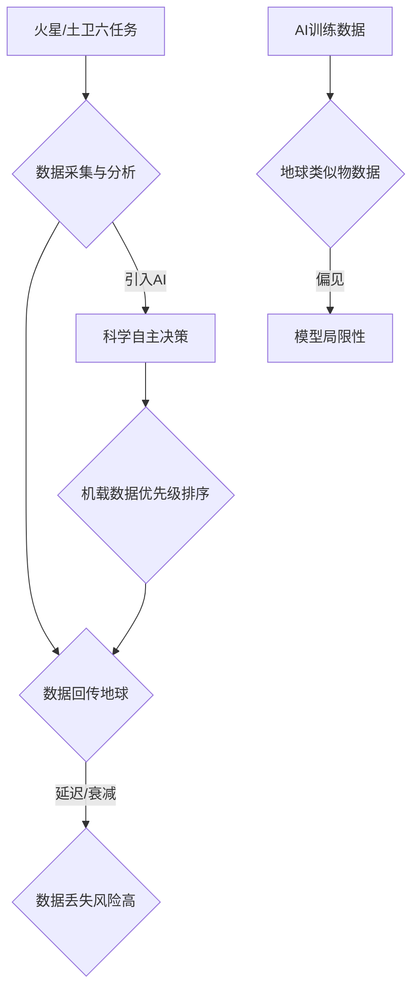

# RobCo获1亿美元C轮融资

**文本 1**

想象一下，机器人不仅能执行预设指令，还能像人类一样理解物理世界并自主解决问题。RobCo 正是这一愿景的践行者。这家公司最近完成了 1 亿美元的 C 轮融资，预示着“物理 AI” 时代的加速到来。这笔资金将如何助力 RobCo 推动工业自动化的革新？让我们一探究竟。

**文本 2**

当人类的足迹不断迈向更遥远的星空，AI 的作用也愈发关键。NASA 正积极探索利用 AI 来增强深空探测任务的自主性，应对海量数据的挑战。AI 如何帮助探测器在茫茫宇宙中自主决策？又将如何处理前所未有的数据洪流？本文将深入探讨 AI 在 NASA 深空探测中的应用与潜力。

---

## RobCo完成1亿美元C轮融资，加速物理AI与工业自动化部署

### RobCo获1亿美元C轮融资

慕尼黑机器人公司RobCo已完成**1亿美元**的C轮融资。本轮资金将用于推进其物理人工智能（Physical AI）路线图、扩大企业级部署，并深化其在美国市场的业务布局。公司目标是成为欧美制造业领域主导的AI机器人公司。

### 全栈平台实现自主性

RobCo成立于2020年，提供集成了模块化硬件与物理AI软件堆栈的自主制造平台。该平台实现了从感知、运动规划到自学习的垂直整合。机器人通过演示和自学习获取特定任务技能，无需手动编程，支持快速部署和迭代。

RobCo声称其系统能减少端到端自动化设置的摩擦，使团队能更专注于核心业务流程。

### 扩展美国市场与RaaS模式

RobCo通过循环机器人即服务（RaaS）模式提供技术，支持机床管理、码垛、分配和焊接等工作流程。公司已在美国旧金山和奥斯汀设立办事处，将美国视为关键增长市场，以应对劳动力限制和回流计划带来的自动化需求。

部署客户包括宝马、DynaEnergetics等。该公司强调，RaaS模式有助于降低运营复杂性和风险。

### 投资方看好物理AI潜力

本轮融资由Lightspeed Venture Partners和Lingotto Innovation领投，Sequoia Capital等跟投。Lightspeed合伙人Alexander Schmitt表示，RobCo在实际生产环境中交付的系统，以及基于物理AI的可扩展平台，符合其高标准。

Lingotto Innovation的Morgan Samet指出，制造业正进入自主性成为决定性优势的新阶段，RobCo的优势在于将经过验证的部署与通往更高自主性的渐进路径相结合。

---

## AI赋能NASA深空探测：自主决策与数据挑战

### AI在深空生命探索中的应用

NASA计划于2028年发射“蜻蜓”号土卫六探测器和ExoMars任务，人工智能将是核心技术，用于样本分析和自主决策。查尔姆斯理工大学的博士研究聚焦于天体生物学中AI的应用，基于对NASA戈达德太空飞行中心工程师的实地考察。

### 漫游车数据传输瓶颈

“好奇号”和“毅力号”漫游车使用质谱仪分析火星样本分子，并将光谱图像传回地球供科学家分析。土卫六距离地球达15亿公里，数据传输单程需**70-90**分钟，信号衰减严重，数据丢失风险高。为解决此问题，NASA转向AI驱动的“科学自主”方案。

### 科学自主与机载决策

“科学自主”原则要求科学仪器能自主运行、分析、调整和指导自身。NASA戈达德中心正在开发AI，使漫游车能自主判断哪些质谱数据最有价值，并优先传输。例如，**Dragonfly**探测器将利用机载AI自主处理和确定土卫六数据的优先级，而非全部回传。

### AI训练数据的局限性

AI的效能受限于训练数据质量。由于缺乏土卫六实测数据，算法需使用地球上的“行星类似物”数据进行训练。研究指出，这些训练数据存在偏向性，倾向于选择易于访问或具有工业相关性的地点，而非纯粹的行星科学目标。

### 地球生命偏见与类比科学

现有训练数据“严重偏向地球生命”，可能导致对地外生命特征的识别偏差。此外，外星行星的特定元素可能干扰仪器，进一步扭曲实验结果。鉴于当前发现机制，有科学家认为天体生物学整体上仍依赖于“一个伟大的类比”。

---

## 结语

感谢您的阅读，我们将继续为您捕捉人工智能领域的每一个创新瞬间。

💬 你对本期哪个内容最感兴趣？欢迎在评论区交流心得！
⭐ 觉得文章不错？点个「在看」分享给同样热爱技术的伙伴们！

    

