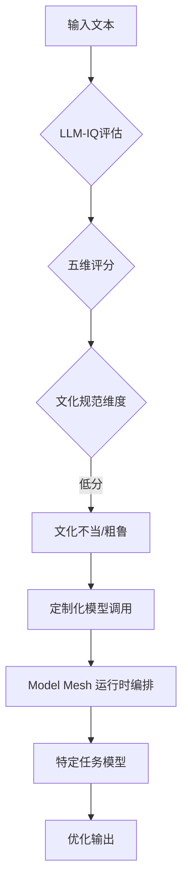

# AI翻译模型面临的文化细微差别挑战

## AI模型翻译中的文化偏见与Articul8的评估框架

### AI翻译模型面临的文化细微差别挑战

尽管谷歌等公司发布了多语言翻译模型（如TranslateGemma，支持55种语言和500个语言对），但现有模型在捕捉口语和文化细微差别方面仍存在明显不足。这种偏见表现为模型可能偏爱特定语言，导致输出在特定文化背景下显得不恰当或粗鲁。

### LLM-IQ评估框架的引入

企业AI平台供应商Articul8开发了**LLM-IQ**代理系统，用于对模型进行多维度定性评估。该框架侧重于流畅性、连贯性、文化规范、一致性和清晰度五个维度。评估结果显示，许多模型在“文化适当性”维度上得分偏低，表明全球化部署仍需克服文化障碍。

### 案例：日语中的语境与礼貌层级

Articul8的客户反馈指出，AI生成的答案虽然准确，但在日语环境中可能被视为“粗鲁”。日语交流高度依赖于说话者、听众和对话目标等上下文信息，存在复杂的礼貌层级。使用错误的语调或措辞，即使技术上准确，也会被视为错误输出，这在供应链指令等高风险场景中影响深远。

### 文化偏见的根源与解决方案

文化偏见源于训练数据的地域集中性。Subramaniyan指出，大量非英语数字化内容主要来自西方或特定来源，导致模型习得了以西方标准定义的“礼貌”和“自然”交互模式。为解决此问题，Articul8采用“Model Mesh”概念，构建独立、特定任务的模型家族，而非依赖单一通用模型进行所有任务的微调。

#### 模型架构的去中心化

Articul8通过运行时编排调用最适合特定任务的模型。通用模型用于获取世界知识，而针对特定语言（如日语）则部署专门训练的模型。这种方法允许模型家族协同工作，实现本地化优化，同时保持全球洞察力，避免了为每个任务构建巨型模型的必要性。

> 🔗 **文章链接**：[https://aibusiness.com/responsible-ai/combatting-cultural-bias-in-the-translation-of-ai-models](https://aibusiness.com/responsible-ai/combatting-cultural-bias-in-the-translation-of-ai-models)

