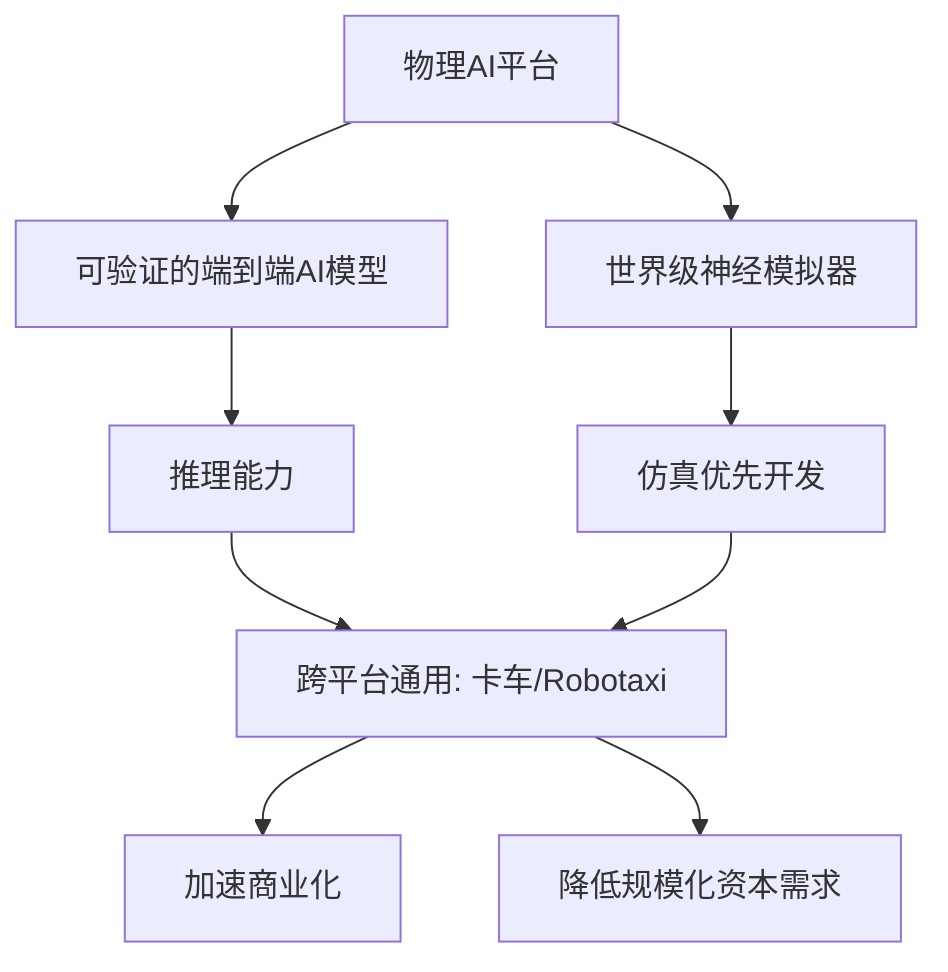
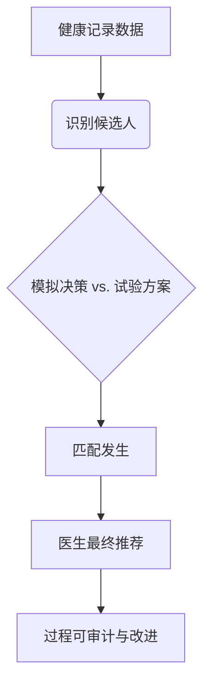

# 平台架构与优势

1. 自动驾驶领域再现重磅融资！Waabi凭借其创新的通用AI平台，一举拿下10亿美元投资，剑指卡车货运与Robotaxi两大万亿级市场。这不仅是资本的豪赌，更是对下一代AI驱动自动驾驶技术路线的关键验证。

2. 当数据分析从“人找洞察”变为“洞察找人”，ThoughtSpot正式发布“智能体舰队”，将AI智能体深度嵌入企业决策的每一个环节。这不仅是工具的升级，更可能重新定义商业智能的未来形态。

3. 企业级AI集成进入深水区。ServiceNow与Anthropic达成战略协议，将Claude模型深度融入其核心工作流平台。这标志着生成式AI正从“聊天演示”走向严肃、复杂的核心业务流程重塑。

---

## Waabi获10亿美元融资，通用AI平台驱动卡车与Robotaxi双线扩张

## 核心融资与战略
加拿大自动驾驶公司Waabi完成**10亿美元**C轮融资，由Khosla Ventures与G2 Venture Partners联合领投，创下加拿大史上最大单轮融资纪录。本轮资金将用于加速其“物理AI平台”的商业化，并正式从自动驾驶卡车领域扩展至机器人出租车市场。

---

## 技术平台：可验证的端到端AI
Waabi成立于2021年，其核心是“物理AI平台”。该平台结合了一个可验证的端到端AI模型与先进的神经模拟器，旨在实现跨车型、地域和环境的泛化能力。公司宣称，同一AI模型可作为自动驾驶卡车与机器人出租车的“共享大脑”。

### 平台架构与优势

该架构的核心是“仿真优先”策略，通过大规模神经模拟减少对昂贵路测的依赖，据称能显著降低规模化所需的资本。

---

## 与Uber的深度合作
Waabi与Uber的合作关系全面升级。根据新协议：
1.  Uber将投入基于里程碑的额外资金，支持基于Waabi Driver的机器人出租车开发。
2.  双方计划共同部署**25,000辆**或更多自动驾驶汽车。
3.  此次合作建立在2023年与Uber Freight的卡车合作及2024年Uber参与其2亿美元B轮融资的基础上。

Uber虽在2020年出售了其自动驾驶部门（ATG），但通过投资Nuro、Wayve等公司及与Waymo、Motional合作，持续布局自动驾驶生态。

---

## 投资者阵容与行业背景
本轮融资吸引了多元化的战略与财务投资者：

| 投资者类型 | 代表机构 |
| :--- | :--- |
| 领投方 | Khosla Ventures, G2 Venture Partners |
| 战略投资者 | NVentures（英伟达）, 沃尔沃风投, 保时捷控股 |
| 财务投资者 | 贝莱德, Radical Ventures, 阿布扎比投资局子公司等 |
| 加拿大资本 | BDC Capital, 加拿大出口发展公司, TELUS等 |

G2 Venture Partners指出，Waabi的方法能“大幅减少规模化所需的资本”。此次融资使Waabi跻身大型自动驾驶融资行列，对比包括Waymo 2024年的56亿美元融资和Cruise 2021年的27.5亿美元融资。

---

## 市场定位与竞争格局
Waabi采取双线并进策略：
- **卡车领域**：已实现高速公路及普通城市道路的自动驾驶能力，并推出直达客户的新模式。
- **Robotaxi领域**：借助与Uber的合作快速切入市场。

在自动驾驶卡车赛道，Einride于2025年10月融资1亿美元，Plus与Kodiak则通过SPAC上市。Waabi试图以通用AI平台差异化竞争，避免局限于单一车型。

首席执行官Raquel Urtasun表示，其城市街道自动驾驶能力为进入Robotaxi市场提供了“前所未有的机会”，旨在为两个垂直领域提供可扩展的解决方案。

> 🔗 **文章链接**：[https://www.therobotreport.com/waabi-raises-1b-to-advance-autonomous-trucks-and-robotaxis/](https://www.therobotreport.com/waabi-raises-1b-to-advance-autonomous-trucks-and-robotaxis/)

---

## ThoughtSpot发布智能体舰队，定义现代分析与决策智能新范式

## ThoughtSpot发布智能体舰队，定义现代分析与决策智能新范式

商业智能正从被动报告转向主动决策。ThoughtSpot现场首席数据与AI官Jane Smith指出，传统BI等待用户发现洞察，而智能体系统能**7x24小时**主动监控多源数据、诊断变化原因并自动触发行动。

---

### 三大变革方向：主动、民主化与语义层

Jane Smith认为，当前BI领域正经历三个关键转变：
1.  **从被动到主动**：智能体系统持续工作，驱动行动导向的分析。
2.  **数据真正民主化**：让更广泛的业务用户能够直接访问和利用数据。
3.  **语义层重新成为焦点**：强大的语义层是理解业务背景、应对AI复杂性的基石。她强调，缺乏对业务背景的严格理解，智能体无法有效行动。

---

### 智能体舰队：团队协作提供现代分析

2024年12月，ThoughtSpot推出了四款新的商业智能智能体，它们作为一个团队协同工作。其核心是**Spotter 3**，这是2024年底首次亮相的智能体的最新迭代。

Spotter 3的特点包括：
- 熟悉Slack、Salesforce等应用环境。
- 不仅能回答问题，还能评估答案质量并持续迭代直至获得正确结果。
- 利用模型上下文协议，整合组织的结构化与非结构化数据，提供富含上下文的答案。用户可通过ThoughtSpot的智能体或自有大语言模型获取答案。

---

### 决策智能：构建可审计的决策供应链

随着能力增强，确保决策可解释、可改进、可信赖变得至关重要。ThoughtSpot将此新兴架构称为“决策智能”。

Jane Smith预测，未来将出现大量“决策供应链”，决策将流经可重复的阶段：数据分析、模拟、行动、反馈。这些人与机器的互动将被记录在“决策记录系统”中。

以制药行业临床试验为例，决策供应链将记录并版本化患者选择的每一步：

该系统会记录如何使用健康记录数据识别候选人、决策如何根据试验方案进行模拟、匹配过程以及医生的最终推荐。整个流程可被审计，并为后续试验提供改进依据。这种对决策流程每个元素的细致记录，构成了可视化的决策供应链。

---

ThoughtSpot将于2月4日至5日参加在伦敦举行的全球AI与大数据博览会。

> 🔗 **文章链接**：[https://www.artificialintelligence-news.com/news/thoughtspot-on-the-new-fleet-of-agents-delivering-modern-analytics/](https://www.artificialintelligence-news.com/news/thoughtspot-on-the-new-fleet-of-agents-delivering-modern-analytics/)

---

## ServiceNow与Anthropic达成AI协议，Claude模型深度集成工作流

## ServiceNow与Anthropic披露人工智能合作协议

在与OpenAI达成协议一周后，ServiceNow于1月28日宣布与Anthropic签署合作协议，将后者的**Claude**模型深度嵌入其跨行业工作流平台，标志着Anthropic在企业AI市场的进一步深入。

---

### 核心合作内容

根据协议，**Claude**将成为ServiceNow Build Agent智能体构建工具的默认模型。该工具旨在让任何技能水平的开发者都能创建和部署能够自主行动与推理的智能体工作流。

合作还包括向ServiceNow全球**29,000**名员工全面推广Claude，并向其工程师与技术团队提供Anthropic的AI编码助手Claude Code。

---

### 战略意图：AI原生工作流

ServiceNow首席执行官Bill McDermott表示，合作旨在通过AI原生工作流将智能转化为行动，为全球大型企业服务。其核心是将构建、部署和扩展关键任务应用的能力赋予每个行业、每个层级的员工。

Anthropic首席执行官Dario Amodei指出，企业常误将AI视为独立工具而非嵌入日常工作。他认为，将AI融入员工每日工作的全范围，是获得更好结果的关键。

---

### 行业背景与竞争格局

此次合作是ServiceNow近期在智能体AI（Agentic AI）和自主运营领域布局的一部分。就在此前一周，ServiceNow刚与Anthropic的竞争对手OpenAI达成多年期合作伙伴关系，计划将OpenAI的**GPT-5.2**模型嵌入其平台，为IT、人力资源和客户服务等职能的自主AI智能体提供支持。

此举也反映了企业服务市场正从单一模型合作转向多模型战略，以降低风险并适配不同场景需求。

---

### Anthropic的企业市场扩张

对Anthropic而言，此次合作是其近期一系列企业级协议中的最新一项。该公司正积极扩大其大语言模型的应用范围，近期合作伙伴还包括全球保险公司安联、埃森哲、IBM、德勤和Snowflake等。

这一系列合作表明，Claude模型正通过头部系统集成商和垂直行业领导者，加速渗透至金融、保险、咨询与技术服务等核心企业市场。

---

### 技术集成与预期影响

Claude模型将被集成到ServiceNow现有的Now Platform中，特别是在医疗保健和生命科学等行业的工作流里。其目标是通过AI智能体自动化处理复杂的、多步骤的IT服务管理、客户支持及业务流程。

对于ServiceNow的客户而言，这意味着更低的AI应用门槛和更高的流程自动化程度。开发者可通过低代码/无代码方式，利用Claude的推理能力构建定制化智能体。

---

### 市场趋势：智能体优先

此次合作凸显了企业软件市场正从“聊天机器人”向“智能体工作流”演进。智能体能够理解上下文、执行多步骤任务并做出自主决策，而不仅仅是回答提问。

ServiceNow Build Agent等工具的推出，旨在将智能体构建能力民主化，使其成为企业数字化运营的核心组件，而不仅仅是附加功能。

---

### 总结

ServiceNow与Anthropic的合作，是领先工作流管理平台与前沿AI模型公司的一次深度绑定。它加速了生成式AI从对话界面向核心业务流程的渗透，并推动了企业AI应用从“工具使用”到“智能体运营”的范式转变。在OpenAI与Anthropic的双重加持下，ServiceNow正构建一个多模型、智能体优先的企业AI平台，以应对日益复杂的自动化需求。

> 🔗 **文章链接**：[https://aibusiness.com/agentic-ai/servicenow-and-anthropic-ai-deal](https://aibusiness.com/agentic-ai/servicenow-and-anthropic-ai-deal)

---

## 结语

感谢您的阅读，我们将继续为您捕捉人工智能领域的每一个创新瞬间。

💬 你对本期哪个内容最感兴趣？欢迎在评论区交流心得！
⭐ 觉得文章不错？点个「在看」分享给同样热爱技术的伙伴们！

    

