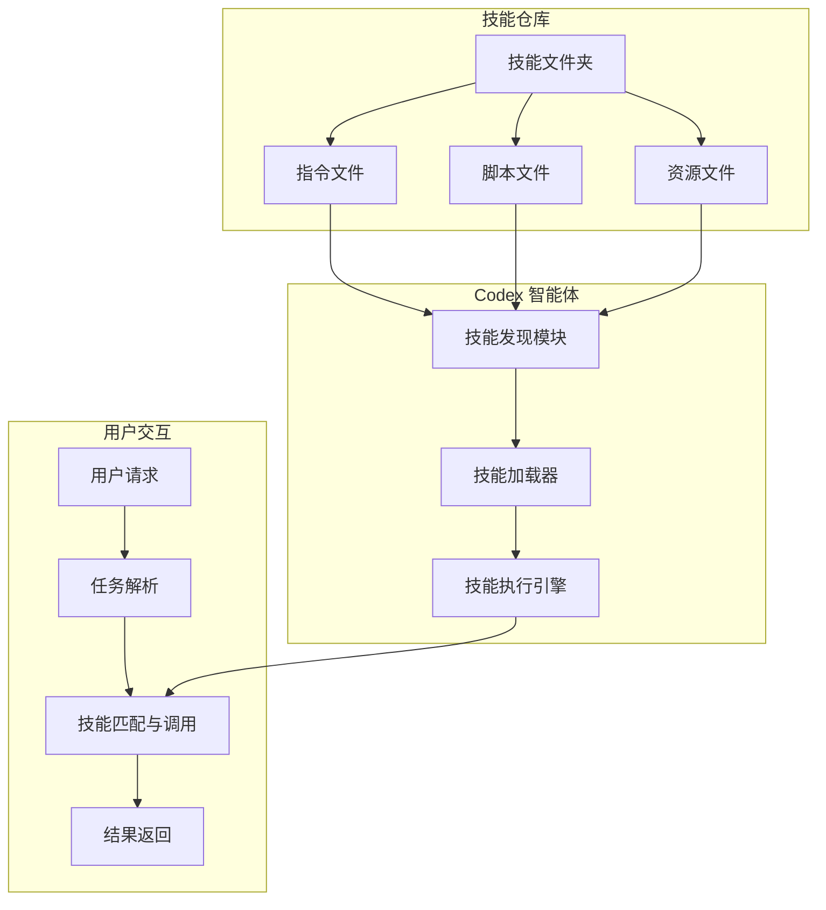

# AI技能库开源，一键安装即用

OpenAI 最新开源项目 `openai/skills` 正引发开发者社区热议，它旨在为 AI 助手构建可复用的技能模块，或将重塑智能体开发范式。

---

## openai/skills (⭐ 2.7k)

# Agent Skills（智能体技能）

Agent Skills（智能体技能）是指包含指令、脚本和资源的文件夹，AI 智能体可以发现并使用这些内容来执行特定任务。一次编写，随处使用。

Codex 利用技能来帮助封装能力，使团队和个人能够以可重复的方式完成特定任务。本仓库收录了可与 Codex 一起使用和分发的技能目录。

## 安装技能

位于 [`.system`](skills/.system/) 目录下的技能会自动安装在最新版本的 Codex 中。

要安装[精选](skills/.curated/)或[实验性](skills/.experimental/)技能，您可以在 Codex 内部使用 `$skill-installer` 命令。

精选技能可以通过名称安装（默认为 `skills/.curated` 目录）：

```bash
$skill-installer gh-address-comments
```

对于实验性技能，需要指定技能文件夹。例如：

```bash
$skill-installer install the create-plan skill from the .experimental folder
```

或者提供 GitHub 目录的 URL：

```bash
$skill-installer install https://github.com/openai/skills/tree/main/skills/.experimental/create-plan
```

安装技能后，请重启 Codex 以加载新技能。

## 技能架构与工作流程

为了更好地理解技能如何被 AI 智能体发现、加载和使用，我们可以通过以下架构图来展示其核心流程：



**流程说明**：
1.  **技能仓库**：存储结构化的技能文件夹，每个技能包含其执行所需的指令、脚本和资源。
2.  **技能发现与加载**：Codex 智能体通过其内置模块发现可用的技能（如自动加载 `.system` 技能，或通过 `$skill-installer` 安装其他技能），并将其加载到执行环境中。
3.  **任务执行**：当用户提出请求时，Codex 解析任务，匹配并调用最合适的已加载技能来执行具体操作。
4.  **结果交付**：技能执行完成后，将结果返回给用户，完成一个闭环。

## 技能的核心价值与设计原则

Agent Skills 的设计旨在解决 AI 智能体能力标准化和复用性的问题。其核心价值在于：

*   **标准化封装**：将解决特定问题的知识、逻辑和工具打包成一个独立的、可描述的单元。这降低了使用复杂能力的门槛。
*   **可发现性**：通过集中的仓库和明确的目录结构（如 `.system`, `.curated`, `.experimental`），智能体或开发者能够轻松找到所需的技能。
*   **可组合性**：不同的技能可以像乐高积木一样被组合起来，以解决更复杂的、多步骤的任务。
*   **生态共享**：开放的技能标准（如 Agent Skills open standard）鼓励社区贡献，形成一个不断增长的能力库，避免重复造轮子。

## 技能开发与使用指南

### 技能结构
一个典型的技能文件夹通常包含以下核心文件：
- `README.md` 或 `instructions.md`：描述技能的目的、使用方法和参数。这是智能体理解该技能的主要依据。
- 执行脚本（如 `.py`, `.js`, `.sh` 文件）：包含实现技能功能的实际代码。
- 配置文件或资源文件：技能运行所需的额外数据或设置。
- `LICENSE.txt`：该技能的具体许可证。

### 安装后的验证
安装技能后，建议通过以下方式验证是否成功：
1.  重启 Codex 客户端或服务。
2.  在 Codex 中尝试调用新技能的名称或相关指令，观察智能体是否能识别并引用该技能。
3.  运行一个简单的测试任务，确保技能能按预期执行。

### 故障排除
- **技能未识别**：确保技能安装在正确的目录下，并且 Codex 已重启。检查技能文件夹名称是否与调用指令匹配。
- **执行错误**：检查技能脚本的依赖是否已满足，以及脚本本身的运行权限和逻辑是否正确。查看 Codex 的错误日志获取详细信息。
- **权限问题**：某些技能可能需要访问网络、文件系统或特定 API，请确保运行环境提供了必要的权限。

## 许可证
每个独立技能的许可证可直接在其目录下的 `LICENSE.txt` 文件中找到。在使用或分发任何技能前，请务必查阅并遵守其对应的许可证条款。

通过采用 Agent Skills，开发者和团队能够构建一个模块化、可扩展且易于维护的 AI 智能体能力体系，显著提升开发效率和任务执行的可靠性。


---


## 结语

感谢您的阅读，我们将继续为您捕捉人工智能领域的每一个创新瞬间。

💬 你对本期哪个内容最感兴趣？欢迎在评论区交流心得！
⭐ 觉得文章不错？点个「在看」分享给同样热爱技术的伙伴们！

<center>
    
</center>