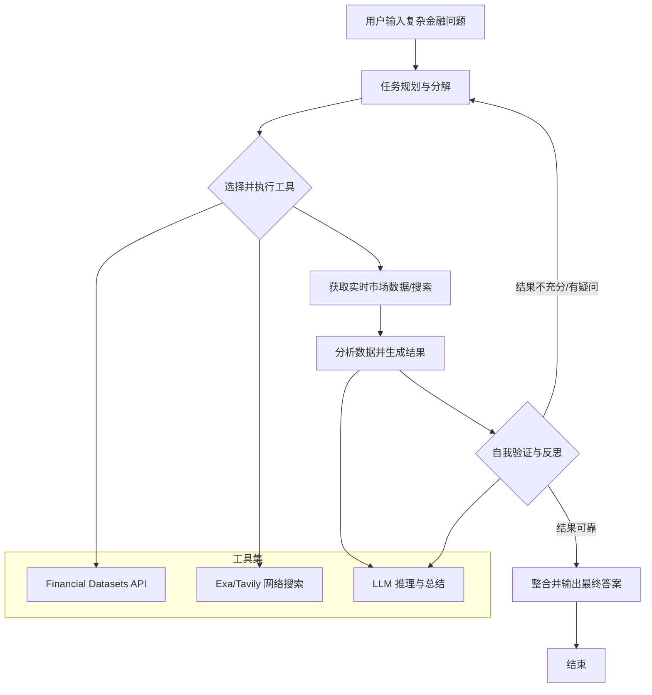

# Dexter 🤖

Dexter 是一个自主的金融研究智能体，它能够在工作中进行思考、规划和学习。它通过任务规划、自我反思和实时市场数据来执行分析。可以将其理解为专为金融研究打造的 Claude Code。


## 概述

Dexter 能够将复杂的金融问题转化为清晰、分步的研究计划。它使用实时市场数据执行这些任务，检查自己的工作，并不断优化结果，直到得出一个有数据支撑的、可靠的答案。

**核心能力：**
*   **智能任务规划**：自动将复杂查询分解为结构化的研究步骤。
*   **自主执行**：选择并执行正确的工具来收集金融数据。
*   **自我验证**：检查自己的工作，并迭代执行直到任务完成。
*   **实时金融数据**：访问利润表、资产负债表和现金流量表。
*   **安全特性**：内置循环检测和步骤限制，防止执行失控。


---

## 先决条件

*   [Bun](https://bun.com) 运行时（v1.0 或更高版本）
*   OpenAI API 密钥（在此[获取](https://platform.openai.com/api-keys)）
*   Financial Datasets API 密钥（在此[获取](https://financialdatasets.ai)）
*   Exa API 密钥（在此[获取](https://exa.ai)）- 可选，用于网络搜索

#### 安装 Bun

如果您尚未安装 Bun，可以使用 curl 进行安装：

**macOS/Linux:**
```bash
curl -fsSL https://bun.com/install | bash
```

**Windows:**
```bash
powershell -c "irm bun.sh/install.ps1|iex"
```

安装完成后，重启终端并验证 Bun 是否已安装：
```bash
bun --version
```

---

## 如何安装

1.  克隆仓库：
```bash
git clone https://github.com/virattt/dexter.git
cd dexter
```

2.  使用 Bun 安装依赖：
```bash
bun install
```

3.  设置环境变量：
```bash
# 复制示例环境文件
cp env.example .env

# 编辑 .env 并添加您的 API 密钥（如果使用云服务提供商）
# OPENAI_API_KEY=your-openai-api-key
# ANTHROPIC_API_KEY=your-anthropic-api-key (optional)
# GOOGLE_API_KEY=your-google-api-key (optional)
# XAI_API_KEY=your-xai-api-key (optional)
# OPENROUTER_API_KEY=your-openrouter-api-key (optional)

# (可选) 如果在本地使用 Ollama
# OLLAMA_BASE_URL=http://127.0.0.1:11434

# 其他必需的密钥
# FINANCIAL_DATASETS_API_KEY=your-financial-datasets-api-key

# 网络搜索（优先使用 Exa，Tavily 作为备选）
# EXASEARCH_API_KEY=your-exa-api-key
# TAVILY_API_KEY=your-tavily-api-key
```

---

## 如何运行

在交互模式下运行 Dexter：
```bash
bun start
```

或在开发模式下使用监视模式：
```bash
bun dev
```

---

## 如何评估

Dexter 包含一个评估套件，用于根据一组金融问题数据集来测试智能体。评估使用 LangSmith 进行跟踪，并采用 LLM 作为评判者（LLM-as-judge）的方法来评分正确性。

**在所有问题上运行评估：**
```bash
bun run src/evals/run.ts
```

**在数据的随机样本上运行评估：**
```bash
bun run src/evals/run.ts --sample 10
```

评估运行器会显示一个实时 UI，展示进度、当前问题和运行的准确率统计信息。结果会记录到 LangSmith 以供分析。

---

## 如何调试

Dexter 将所有工具调用记录到一个草稿文件中，用于调试和历史跟踪。每个查询都会在 `.dexter/scratchpad/` 目录下创建一个新的 JSONL 文件。

**草稿文件位置：**
```
.dexter/scratchpad/
├── 2026-01-30-111400_9a8f10723f79.jsonl
├── 2026-01-30-143022_a1b2c3d4e5f6.jsonl
└── ...
```

每个文件包含换行符分隔的 JSON 条目，跟踪以下内容：
*   **init**：原始查询
*   **tool_result**：每次工具调用，包含参数、原始结果和 LLM 摘要
*   **thinking**：智能体的推理步骤

**草稿文件条目示例：**
```json
{"type":"tool_result","timestamp":"2026-01-30T11:14:05.123Z","toolName":"get_income_statements","args":{"ticker":"AAPL","period":"annual","limit":5},"result":{...},"llmSummary":"Retrieved 5 years of Apple annual income statements showing revenue growth from $274B to $394B"}
```

这使得检查智能体收集了哪些数据以及它如何解释结果变得非常容易。

---

## 技术架构与工作流程

Dexter 的核心是一个基于规划-执行-反思循环的自主智能体。其工作流程可以概括如下：



这个循环确保了智能体能够系统性地处理问题，并在必要时调整其策略，最终交付高质量的研究成果。

## 许可证

本项目基于 MIT 许可证授权。