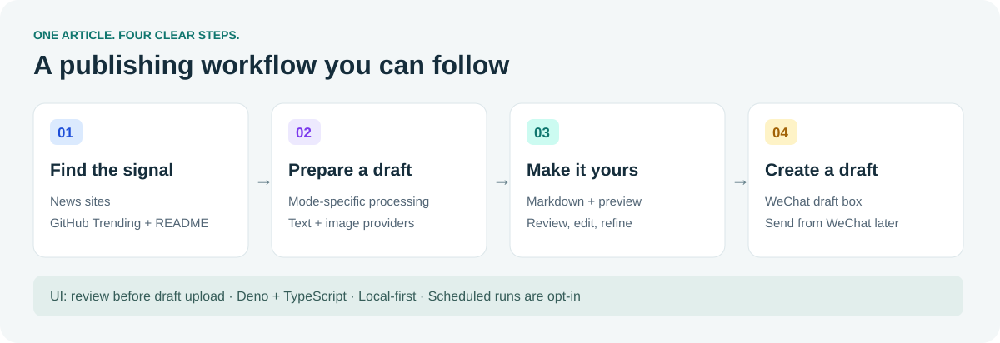
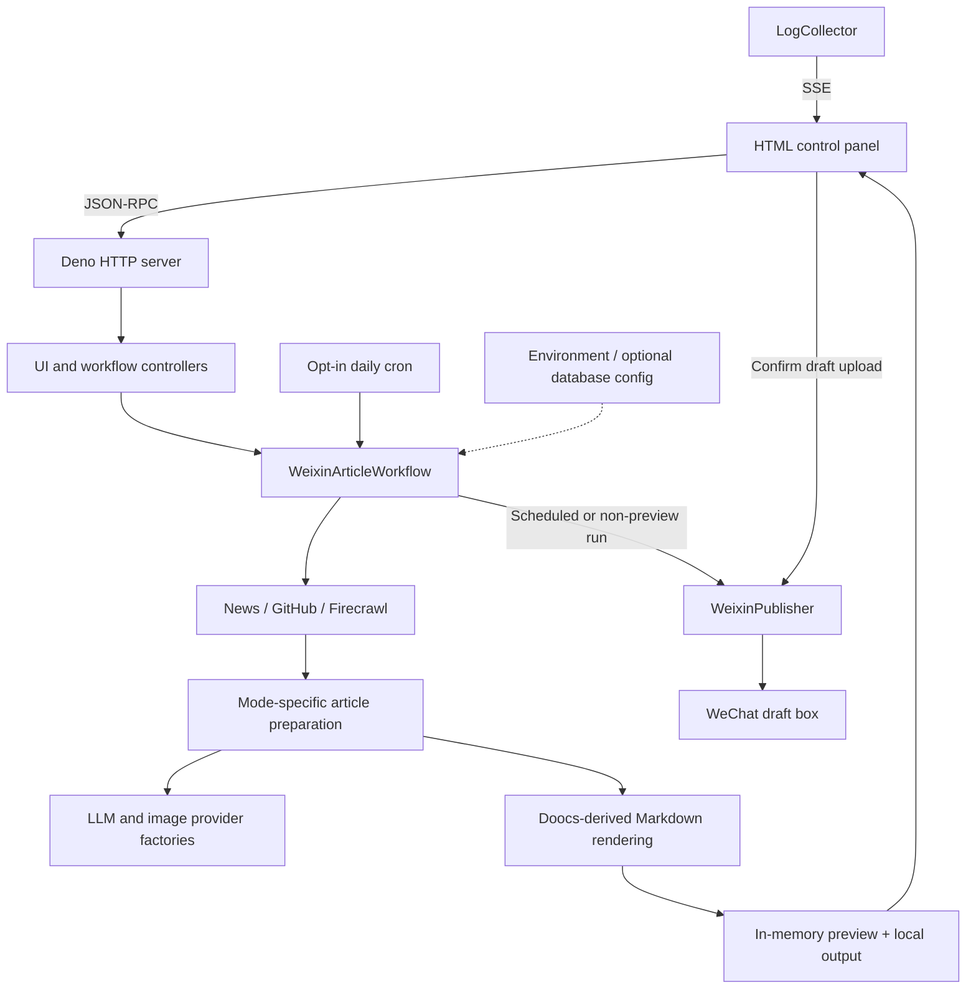

# Architecture and code tour

**English** | [简体中文](ARCHITECTURE.zh-CN.md) · [All guides](README.md) · [Project introduction](../README.md)

## The project in one minute

AITrendPublisher is a local editorial pipeline. A plain HTML/JavaScript control panel sends JSON-RPC requests to a Deno server. A workflow coordinates source collection, optional deduplication, mode-specific article preparation, rendering, storage, and WeChat draft creation. The browser receives logs over Server-Sent Events.

There is no React, Next.js, Python service, or mandatory database in the core setup. TypeScript runs directly in Deno; dependencies come from JSR and npm. The large single-file UI and workflow service are the main places to regain context.

## Runtime boundaries

| Layer | Entry point | Responsibility |
| --- | --- | --- |
| Bootstrap | `src/index.ts` | Initialize configuration/logging; optionally start cron; launch loopback HTTP server |
| HTTP | `src/server.ts` | Serve UI and local resources; JSON-RPC routing; SSE logs |
| UI | `public/index.html` | Mode selection, configuration, logs, preview, Markdown editor, AI refinement |
| Controllers | `src/controllers/` | Accept asynchronous workflow triggers; update preview; render/edit Markdown; confirm upload |
| Orchestration | `src/services/weixin-article.workflow.ts` | Sequence scraping, preparation, rendering, image work, storage, and draft upload |
| Workflow mechanics | `src/works/` | Step execution, retry/timeout/error handling, metrics |
| Sources | `src/data-sources/`, `src/modules/scrapers/` | Source configuration and content retrieval |
| Article processing | `src/modules/summarizer/`, `src/prompts/` | Translation, summary, expansion, titles, and refinement prompts |
| Providers | `src/providers/` | Text models, image generation, embedding, and reranking adapters |
| Rendering | `src/modules/render/` | Doocs-derived Markdown processing, themes, formula/diagram support |
| Delivery | `src/modules/publishers/weixin.publisher.ts` | Access token, image uploads, and draft API |
| Storage | `src/utils/*storage*`, `*registry*`, `preview-store.ts` | Local output/history, deduplication, and current preview |
| Optional database | `src/db/`, config sources | MySQL connection and Drizzle schema for configuration/data/vector records |
| Demonstration | `scripts/demo.ts` | Separate fixture backend serving the same UI; simplified escaped renderer; no production imports |

## Follow one button click

1. `runWorkflow()` in `public/index.html` sends `triggerWorkflow` with the selected mode and `previewOnly: true`.
2. `workflow.controller.ts` starts `workflow.execute()` asynchronously. The UI polls `getArticlePreview` while logs arrive through SSE.
3. The workflow refreshes providers, validates WeChat access, chooses sources, and retrieves content.
4. Processing differs by mode. GitHub can preserve README content; news modes translate or summarize. Deduplication, local registries, and provider configuration influence the path.
5. The renderer produces HTML and Markdown. The workflow prepares a cover, saves article output, and stores one current preview in memory.
6. The editor can update the Markdown or call `refineContent`. Canonical `preview.markdown` is now used when reopening the editor, avoiding duplicate title/section reconstruction.
7. `confirmPublish()` rerenders with image processing enabled, uploads the cover, and calls `WeixinPublisher.publish()`, which creates a draft and returns `status: "draft"`.

The main workflow is not a pure preview pipeline: WeChat validation and cover upload may happen before step 7. A returned draft media ID is not proof of a public article URL. Use the Official Account backend to find and send the draft.

## Where do I change something?

| Change | Start here |
| --- | --- |
| Add/remove news sources | `src/data-sources/getDataSources.ts` |
| Restore URL/topic controls | Commented sections and `setMode()` in `public/index.html`; check backend payload handling too |
| Change article tone or structure | `src/prompts/`, then `src/modules/summarizer/ai.summarizer.ts` |
| Add a model provider | `src/providers/interfaces/llm.interface.ts` and `src/providers/llm/llm-factory.ts` |
| Change cover behavior | Cover-generation branch in `weixin-article.workflow.ts` and `providers/image-gen/` |
| Adjust Markdown layout | `src/modules/render/weixin/doocs-md.renderer.ts` and Doocs theme files |
| Change daily schedule | `src/controllers/cron.ts`; opt-in gate in `src/index.ts` |
| Investigate duplicate content | Workflow deduplication steps, registries, and `src/services/vector-service.ts` |
| Change what upload means | `confirmPublish()` and `WeixinPublisher.publish()` |
| Refresh screenshots | Run the [demo walkthrough](DEMO.md) and capture the labeled demo UI |

## Constraints that matter

- One process holds one current preview; this is not a multi-user publishing CMS.
- The UI uses external CDNs. The backend demo needs no dependencies, but the UI still needs network access for those assets.
- MySQL and embeddings are optional capabilities, not a complete documented migration/deployment workflow.
- The remote-access checks and static-file handling need further hardening before hosting for other users. Loopback is the supported default.
- Full application type checking currently fails; [VERIFICATION.md](VERIFICATION.md) separates the existing errors from verified demo behavior.
- Provider adapters and scraper branches being present does not prove their upstream services still work with every configured model/site.
