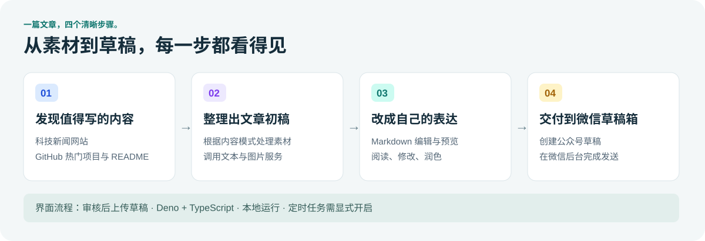
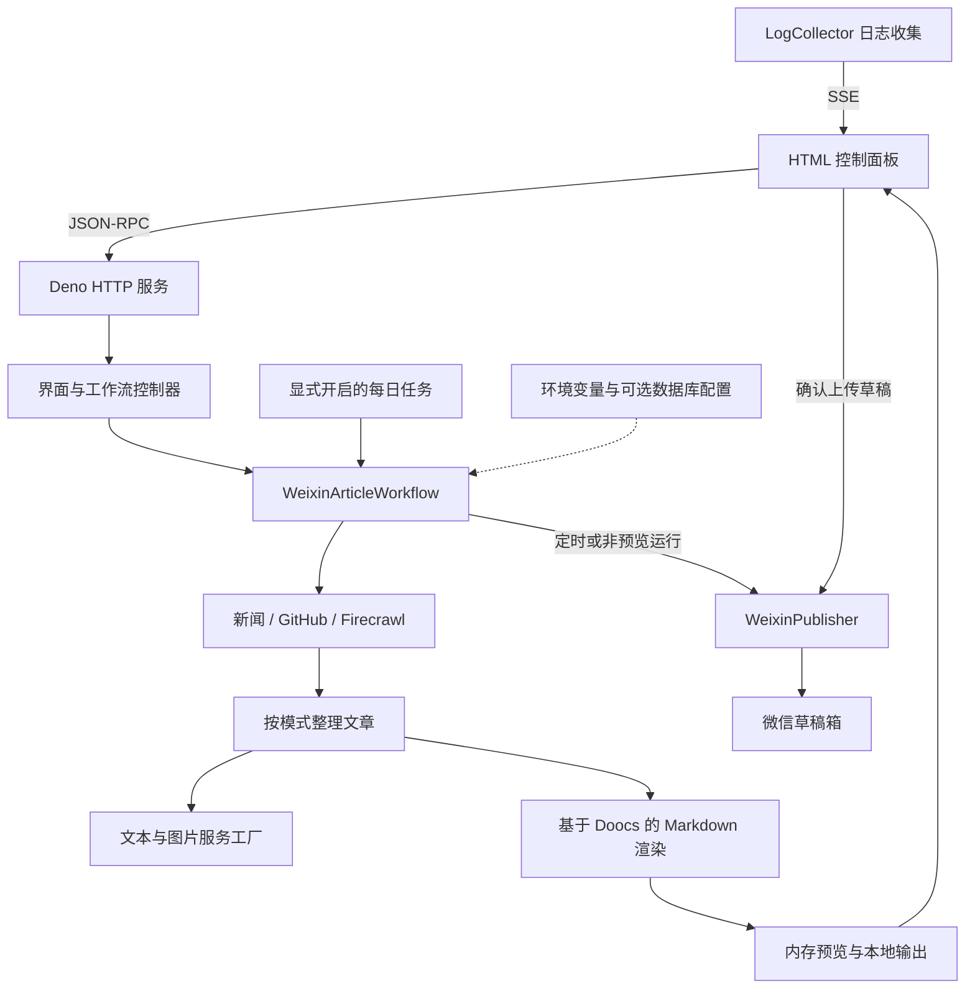

# 架构与代码导览

[English](ARCHITECTURE.md) | **简体中文** · [全部文档](README.md) · [项目介绍](../README.zh-CN.md)

## 一分钟理解项目

AITrendPublisher 是一个本地采编流程。原生 HTML/JavaScript 控制面板通过 JSON-RPC 向 Deno 服务发送请求，工作流串起素材采集、可选去重、按模式整理文章、渲染、存储和微信草稿创建。浏览器通过 Server-Sent Events（SSE）接收日志。

核心运行方式没有 React、Next.js、Python 服务或必需数据库。TypeScript 直接运行在 Deno 中，依赖来自 JSR 和 npm。了解代码时，可以先看单文件前端和主工作流服务。

## 各层负责什么？

| 层次 | 入口 | 职责 |
| --- | --- | --- |
| 启动 | `src/index.ts` | 初始化配置和日志，按开关启动定时任务，运行本机 HTTP 服务 |
| HTTP | `src/server.ts` | 提供界面与本地资源、JSON-RPC 路由和 SSE 日志 |
| 前端 | `public/index.html` | 模式选择、配置、日志、预览、Markdown 编辑和 AI 润色 |
| 控制器 | `src/controllers/` | 接收异步工作流请求，更新预览，渲染和编辑 Markdown，确认上传 |
| 主流程 | `src/services/weixin-article.workflow.ts` | 协调采集、文章整理、渲染、图片处理、存储和草稿上传 |
| 工作流机制 | `src/works/` | 步骤执行、重试、超时、错误处理和指标 |
| 数据源 | `src/data-sources/`、`src/modules/scrapers/` | 数据源配置与内容抓取 |
| 文章处理 | `src/modules/summarizer/`、`src/prompts/` | 翻译、摘要、扩写、标题和润色提示词 |
| 服务适配 | `src/providers/` | 文本模型、图片生成、向量与重排适配器 |
| 渲染 | `src/modules/render/` | 基于 Doocs 的 Markdown 处理、主题、公式和图表支持 |
| 交付 | `src/modules/publishers/weixin.publisher.ts` | 微信访问令牌、图片上传和草稿接口 |
| 存储 | `src/utils/*storage*`、`*registry*`、`preview-store.ts` | 本地输出与历史、去重及当前预览 |
| 可选数据库 | `src/db/` 和配置源 | MySQL 连接及用于配置、数据和向量记录的 Drizzle schema |
| 演示 | `scripts/demo.ts` | 为同一前端提供示例后端，使用转义后的简化渲染，不导入生产模块 |

## 跟踪一次按钮点击

1. `public/index.html` 中的 `runWorkflow()` 发送 `triggerWorkflow`，附带选定模式和 `previewOnly: true`。
2. `workflow.controller.ts` 异步启动 `workflow.execute()`。界面轮询 `getArticlePreview`，同时通过 SSE 接收日志。
3. 工作流刷新模型服务，校验微信权限，选择数据源并获取内容。
4. 不同模式走不同处理逻辑：GitHub 可以保留 README，新闻模式可能翻译或总结。去重、本地记录和模型配置也会影响路径。
5. 渲染器生成 HTML 和 Markdown，工作流准备封面、保存本地文章，并在内存中保留一份当前预览。
6. 编辑器可修改 Markdown 或调用 `refineContent`。重新打开时优先读取 `preview.markdown`，避免重复拼接标题和段落。
7. `confirmPublish()` 启用图片处理后重新渲染，上传封面，再调用 `WeixinPublisher.publish()` 创建草稿，返回 `status: "draft"`。

主工作流并非纯预览流程：微信校验和封面上传可能在第 7 步之前发生。返回草稿素材 ID 也不代表已经获得公开文章链接，请到微信公众平台后台查找并发送草稿。

## 想修改功能，从哪里开始？

| 要修改什么 | 查看位置 |
| --- | --- |
| 添加或删除新闻来源 | `src/data-sources/getDataSources.ts` |
| 恢复单链接和主题搜索入口 | `public/index.html` 中被注释的控件及 `setMode()`，同时检查后端参数处理 |
| 调整文章语气与结构 | `src/prompts/`，再看 `src/modules/summarizer/ai.summarizer.ts` |
| 增加模型服务商 | `src/providers/interfaces/llm.interface.ts` 和 `src/providers/llm/llm-factory.ts` |
| 修改封面行为 | `weixin-article.workflow.ts` 的封面生成分支，以及 `providers/image-gen/` |
| 调整文章排版 | `src/modules/render/weixin/doocs-md.renderer.ts` 和 Doocs 主题文件 |
| 修改每日运行时间 | `src/controllers/cron.ts`；启用开关在 `src/index.ts` |
| 排查重复内容 | 工作流去重步骤、本地记录，以及 `src/services/vector-service.ts` |
| 修改上传行为 | `confirmPublish()` 和 `WeixinPublisher.publish()` |
| 更新截图 | 按[演示步骤](DEMO.zh-CN.md)运行并截取明确标注的演示界面 |

## 需要理解的限制

- 每个进程只有一份当前预览，不是多用户内容管理系统。
- 界面依赖公共 CDN。演示后端无需依赖安装，但界面资源仍需联网获取。
- MySQL 和向量服务属于可选功能，目前没有完整的数据库迁移与部署指南。
- 若要提供给其他用户远程访问，仍需完善认证和静态文件访问限制；当前默认支持本机使用。
- 主应用的类型检查仍未通过，[验证记录](VERIFICATION.zh-CN.md)区分了原有问题与已验证的演示行为。
- 存在某个服务适配器或采集分支，不代表每个上游模型和网站当前都能正常使用。
