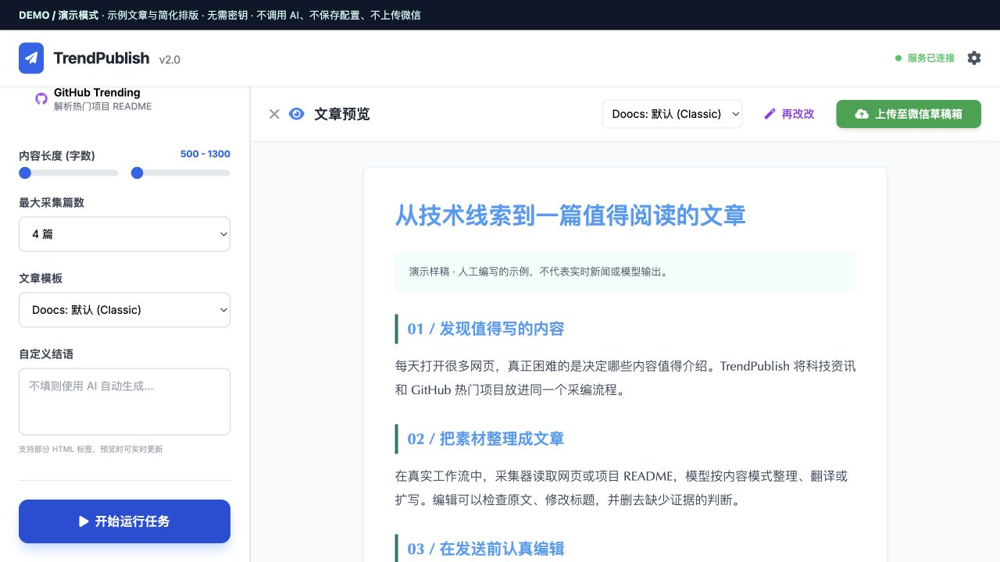
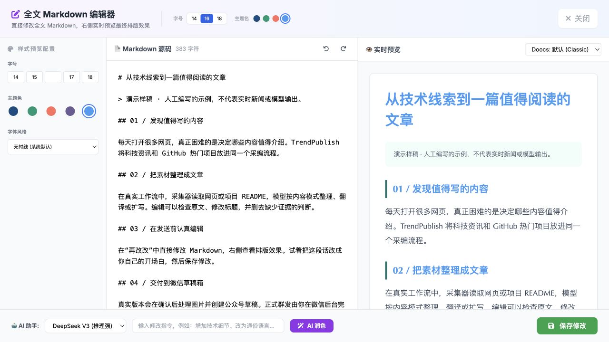

# 五分钟了解项目

[English](DEMO.md) | **简体中文** · [全部文档](README.md) · [项目介绍](../README.zh-CN.md)

演示使用**真实的 `public/index.html` 界面**，搭配独立的示例后端。它通过人工编写的中文样稿展示模式选择、文章预览与编辑，不抓取网站、不生成文本或图片、不保存密钥，也不连接微信。演示的简化 HTML 渲染器支持标题、段落、引用和分隔线，不等同于生产环境的 Doocs 渲染器。

## 认识当前界面

当前界面尚未提供英文版本。阅读英文文档不会改变应用语言；下面的标签与截图中显示的一致。

| 界面标签 | 英文含义 | 用途 |
| --- | --- | --- |
| 演示模式 | Demo mode | 确认当前使用示例数据 |
| 科技新闻 | Technology news | 选择新闻数据源模式 |
| 内容长度（字数） | Content length | 设置中文内容长度目标，不保证等于英文单词数量 |
| 最大采集篇数 | Maximum articles | 选择新闻采集数量 |
| 文章模板 | Article template | 选择排版样式 |
| 自定义结语 | Custom closing paragraph | 真实应用可填写结语；演示请在 Markdown 中修改 |
| 开始运行任务 | Run task | 启动文章处理流程 |
| 实时运行日志 | Live logs | 查看流程进度 |
| 文章预览 | Article preview | 检查整理后的文章 |
| 再改改 | Edit / refine | 打开全文 Markdown 编辑器 |
| 保存修改 | Save changes | 将修改应用到预览 |
| AI 润色 | AI rewrite | 真实应用中请求模型辅助修改 |
| 上传至微信草稿箱 | Upload to WeChat drafts | 创建草稿，不会向订阅者群发 |
| 配置中心 | Settings | 通过齿轮按钮设置模型等服务 |
| 关闭 | Close | 返回上一层界面 |

## 样稿在讲什么？

标题是“从技术线索到一篇值得阅读的文章”。四个部分分别介绍发现素材、整理文章、交付前编辑、上传微信草稿箱。绿色提示明确说明这是一篇人工编写的示例，不代表实时新闻或模型输出。你也可以换成英文 Markdown 体验编辑器，但这不会调用真实写作提示词。

## 启动

在仓库根目录运行，克隆步骤见[配置指南](GETTING_STARTED.zh-CN.md)：

```bash
deno task --config demo.json demo
```

打开 `http://127.0.0.1:8001`。顶部深色的 **DEMO / 演示模式** 横条用于标识当前会话。请勿输入真实密钥。演示后端只读取界面文件，修改保留在内存中，没有读取环境变量或写入文件的权限。

## 跟着操作一遍

| 步骤 | 操作 | 观察什么 |
| --- | --- | --- |
| 1. 选择 | 点击科技新闻 | 查看新闻模式的篇数和内容长度选项 |
| 2. 运行 | 点击开始运行任务；必要时向下滚动左侧栏 | 界面轮询后显示示例文章 |
| 3. 阅读 | 检查文章预览 | 样稿说明采集、整理、编辑和草稿交付 |
| 4. 编辑 | 点击再改改 | Markdown 源码和预览并排显示 |
| 5. 保存 | 改一句话，点击保存修改 | 预览更新；关闭再打开编辑器，确认修改保留 |
| 6. 排版 | 选择 Elegant（优雅）预览模板 | 演示会改变标题装饰；真实版本使用更完整的 Doocs 主题 |
| 7. 了解交付 | 点击上传至微信草稿箱 | 提示演示模式不会实际上传 |
| 8. 比较模式 | 关闭预览，选择 GitHub Trending，再运行 | 加载不同标题的样稿，新闻篇数和长度控件隐藏 |

演示中的 AI 润色和配置保存会返回解释性错误，不会假装模型调用成功或设置已经保存。自定义结语请直接在演示的 Markdown 编辑器中修改。





## 可以这样向别人介绍

“这是一个用于 AI 资讯和开源项目介绍的本地采编工作台。我先选择素材来源，整理出文章，再查看公众号风格的排版。如果结构或表达需要调整，就在这个面板里直接编辑 Markdown。连接真实服务后，也可以让 AI 辅助修改。确认内容后，应用会上传到微信草稿箱，最后是否发送由我在公众号后台决定。”

演示时请说明这是示例数据，不要把样稿描述成最新新闻，也不要把示例瞬间出现的速度当成真实模型处理耗时。

## 更新截图

使用干净的演示会话，分别截取运行前的控制面板、样稿加载后的文章预览，以及显示文章开头的 Markdown 编辑器。面板允许时保留演示横条，并注明截图使用示例内容。PNG 文件保存在 `docs/assets/`，沿用已有文件名。不要截取含真实配置或密钥的会话。

演示标签页共享同一份内存预览。需要全新的后端状态时重启服务；再次运行任务会替换样稿。按 Ctrl+C 停止演示。
